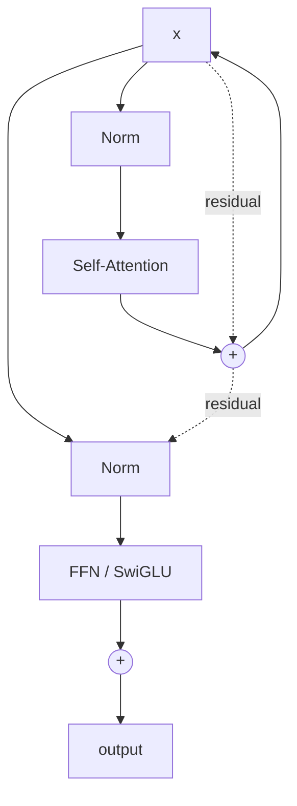

# Chapter 5: Architecture — dense, MoE, attention variants

> Reading time: ~50 minutes. This is the deepest chapter on transformer architecture you'll find outside an industry architecture team. By the end, you should be able to read any frontier-lab technical report and understand every architectural choice in it — and to explain why MLA, DeepSeekMoE, and RoPE exist at all.

*Current as of early 2025.*

## 5.1 The mental model

The transformer is ten years old. It has been refined, compressed, and stretched in every direction, but the structure is unchanged: stacked layers of attention and position-wise MLPs, with residuals and norms in between. The frontier work of 2024–2025 is not about new high-level ideas; it is about which of the dozen well-known variants to use, at what scale, with what trade-off. The architecture choices that distinguish a Llama-3 from a DeepSeek-V3 from a Qwen3-MoE are not inventions — they are selections and tunings of pieces that have all been on the shelf since 2020–2023.

The choices that determine a frontier architecture:

- **Attention pattern** — MHA, MQA, GQA, or MLA. The single biggest determinant of inference memory and serving cost.
- **Position encoding** — sinusoidal, learned, RoPE, AliBi, NoPE. RoPE has won for text.
- **Normalization** — LayerNorm (with or without bias) or RMSNorm. RMSNorm is the modern default.
- **Activation** — ReLU, GeLU, SwiGLU, GeGLU. SwiGLU has won.
- **FFN block** — dense or Mixture-of-Experts. The second biggest determinant of serving cost after the attention pattern.
- **MoE routing** — top-$k$ with auxiliary loss (Switch-style), top-$k$ with no auxiliary loss and bias balancing (DeepSeekMoE-style). The auxiliary loss is increasingly being replaced.
- **Long-context strategy** — RoPE scaling (linear, NTK-aware, YaRN), sliding window, dilated attention, hybrid.
- **Training objective** — next-token only, or multi-token prediction (MTP). MTP is a small but consistent quality win at near-zero extra cost.

In this chapter we walk through each. The structure is bottom-up: standard layer first, then attention, then normalization and activation, then FFN vs MoE, then MoE routing variants, then MTP and long-context. We end with the actual configurations of DeepSeek-V3, Llama-3-70B, Qwen3, and Mixtral as case studies.

The MLA and MoE implementations in this chapter are simplified versions of the patterns used in DeepSeek-V2/V3 and Switch Transformer; they are not full production kernels. Production implementations add fused kernels, quantization, and routing sharding that are out of scope here. Chapter 20 covers those.

## 5.2 The standard decoder-only transformer

The original transformer [\[30\]](../appendix/b-references.md#30-transformer-vaswani-et-al) is an encoder-decoder; the modern frontier uses the decoder-only variant, where the model is a stack of $L$ identical blocks, each containing a masked multi-head self-attention and a position-wise feed-forward network, with residuals and norms in between.

A single block, in PyTorch:

```python
import torch
import torch.nn as nn
import torch.nn.functional as F


class RMSNorm(nn.Module):
    """RMSNorm: y = x / rms(x) * weight, with no mean-centering."""
    def __init__(self, dim: int, eps: float = 1e-6):
        super().__init__()
        self.weight = nn.Parameter(torch.ones(dim))
        self.eps = eps

    def forward(self, x: torch.Tensor) -> torch.Tensor:
        # Compute root mean square over the last dim
        rms = x.pow(2).mean(dim=-1, keepdim=True).add(self.eps).rsqrt()
        return x * rms * self.weight


class SwiGLU(nn.Module):
    """SwiGLU: gated linear unit with SiLU (a.k.a. Swish) activation.
    The FFN block uses up, gate, and down projections, with the gate
    passed through SiLU and multiplied elementwise with the up output.
    """
    def __init__(self, d_model: int, d_ff: int):
        super().__init__()
        self.up = nn.Linear(d_model, d_ff, bias=False)
        self.gate = nn.Linear(d_model, d_ff, bias=False)
        self.down = nn.Linear(d_ff, d_model, bias=False)

    def forward(self, x: torch.Tensor) -> torch.Tensor:
        return self.down(F.silu(self.gate(x)) * self.up(x))


class StandardAttention(nn.Module):
    """Standard multi-head self-attention with causal masking.
    Q, K, V all have the same number of heads.
    """
    def __init__(self, d_model: int, n_heads: int):
        super().__init__()
        assert d_model % n_heads == 0
        self.n_heads = n_heads
        self.head_dim = d_model // n_heads
        self.qkv = nn.Linear(d_model, 3 * d_model, bias=False)
        self.out = nn.Linear(d_model, d_model, bias=False)

    def forward(self, x: torch.Tensor) -> torch.Tensor:
        B, T, C = x.shape
        qkv = self.qkv(x)                                       # (B, T, 3C)
        q, k, v = qkv.chunk(3, dim=-1)
        q = q.view(B, T, self.n_heads, self.head_dim).transpose(1, 2)
        k = k.view(B, T, self.n_heads, self.head_dim).transpose(1, 2)
        v = v.view(B, T, self.n_heads, self.head_dim).transpose(1, 2)
        # Scaled dot-product attention with causal mask
        out = F.scaled_dot_product_attention(q, k, v, is_causal=True)
        out = out.transpose(1, 2).contiguous().view(B, T, C)
        return self.out(out)


class DecoderBlock(nn.Module):
    """One pre-norm decoder block: x = x + attn(norm1(x)); x = x + ffn(norm2(x))."""
    def __init__(self, d_model: int, n_heads: int, d_ff: int):
        super().__init__()
        self.norm1 = RMSNorm(d_model)
        self.attn = StandardAttention(d_model, n_heads)
        self.norm2 = RMSNorm(d_model)
        self.ffn = SwiGLU(d_model, d_ff)

    def forward(self, x: torch.Tensor) -> torch.Tensor:
        x = x + self.attn(self.norm1(x))
        x = x + self.ffn(self.norm2(x))
        return x
```

The equations for one block, in math:

$$
\mathbf{h}_\ell = \mathbf{h}_{\ell-1} + \text{Attn}\!\left(\text{Norm}(\mathbf{h}_{\ell-1})\right)
$$

$$
\mathbf{h}_{\ell+1} = \mathbf{h}_\ell + \text{FFN}\!\left(\text{Norm}(\mathbf{h}_\ell)\right)
$$

with $\mathbf{h}_0 = \text{Embed}(\text{token IDs}) + \text{Position}(\text{positions})$.

A few things to note about this layer that distinguish it from a 2018-vintage transformer:

- **Pre-norm, not post-norm.** The norm is applied *before* the attention/FFN, not after. Pre-norm makes deep stacks trainable without learning-rate warmup gymnastics. Almost every frontier model uses pre-norm; post-norm survives mainly in vision transformers and some encoder models.
- **RMSNorm, not LayerNorm.** We discuss this in §5.6. The mean-centering step of LayerNorm is dropped; only the per-channel scale is learned.
- **No bias on linear layers.** Most frontier models disable biases on the QKV/FFN projections. The `bias=False` in the code above is standard. Biases are kept on norms and on some output projections.
- **SwiGLU FFN, not ReLU FFN.** We discuss this in §5.7. The FFN is gated.
- **Tied input/output embeddings.** Most frontier models tie the input embedding and the output projection (so the same matrix is used to embed tokens at the input and to project logits at the output). Saves parameters and slightly improves quality.

A diagram of one layer:

```
                 +-----------+
                 |  input x  |
                 +-----+-----+
                       |
                  RMSNorm
                       |
                       v
              +--------+--------+
              |  Multi-Head     |
              |  Self-Attention |
              +--------+--------+
                       |
                       v
                     (+) <------- residual
                       |
                  RMSNorm
                       |
                       v
              +--------+--------+
              |  FFN            |
              |  (SwiGLU)       |
              +--------+--------+
                       |
                       v
                     (+) <------- residual
                       |
                       v
                 +-----------+
                 |   output  |
                 +-----------+
```

In Mermaid, the same flow:



The full model is a stack of $L$ such blocks, with a token embedding at the input and a final RMSNorm + linear projection to the vocabulary at the output.

## 5.3 Attention patterns: MHA, MQA, GQA, MLA

Attention is the only operation in a transformer that scales quadratically in sequence length. Everything else is linear (per token). The shape of the attention operation — how many Q heads, how many K/V heads, how K and V are stored — determines both the quality and the inference memory cost.

### 5.3.1 The four patterns

**Multi-Head Attention (MHA).** The original [\[30\]](../appendix/b-references.md#30-transformer-vaswani-et-al). $H$ query heads, $H$ key heads, $H$ value heads. Each head has dimension $d_h = d_\text{model}/H$. The KV cache stores $2 \cdot H \cdot d_h = 2 d_\text{model}$ values per token per layer (the 2 is for K and V). For an 80-layer model with $d_\text{model} = 8192$ and 32K context, the KV cache is $80 \cdot 2 \cdot 8192 \cdot 32768 \cdot 2 \text{ bytes (BF16)} \approx 80 \text{ GB}$. Per sequence. This is the dominant memory cost of long-context inference, and is why MHA is rarely used for serving frontier models.

**Multi-Query Attention (MQA).** Shazeer (2019) — multiple Q heads share a *single* K head and a *single* V head. $H$ Q heads, 1 K head, 1 V head. KV cache memory per token per layer drops to $2 \cdot d_h = 2 d_\text{model} / H$. For the 80-layer / 8192-hidden / 64-head case, that is $80 \cdot 2 \cdot 128 \cdot 32768 \cdot 2 \approx 1.25 \text{ GB}$ per sequence. Big win, but MQA hurts quality slightly compared to MHA — the single K/V head is a bottleneck.

**Grouped-Query Attention (GQA).** The compromise from Ainslie et al. (2023) [\[20\]](../appendix/b-references.md#20-gqa). Multiple Q heads share K/V heads in *groups* of $g$. $H$ Q heads, $H/g$ K heads, $H/g$ V heads. Typical $g \in \{4, 8\}$ — Llama-3-70B uses $g=8$ (8 KV heads for 64 Q heads). GQA recovers most of the quality of MHA at $g \times$ less KV memory. It is the dominant attention pattern for post-2023 dense models: Llama 2/3, Mistral, Qwen3 (dense variant), Gemma, and most others.

**Multi-head Latent Attention (MLA).** The DeepSeek variant from DeepSeek-V2 [\[2\]](../appendix/b-references.md#2-deepseek-v2) and V3 [\[1\]](../appendix/b-references.md#1-deepseek-v3). The Q, K, V are all derived from a *compressed* latent vector $c_t \in \mathbb{R}^{d_c}$ of the input. The KV cache stores the latent vector, not the per-head K and V. The decompression happens on-the-fly during attention. The cache size is $d_c$ per token per layer, where $d_c$ is much smaller than $H \cdot d_h$ (in DeepSeek-V3, $d_c = 512$ for the KV side).

The MLA math, in compressed form:

$$
\mathbf{c}_t = W^{DKV} \mathbf{h}_t \in \mathbb{R}^{d_c}
$$

$$
\mathbf{k}_t^C = W^{UK} \mathbf{c}_t \in \mathbb{R}^{H \cdot d_h}
$$

$$
\mathbf{v}_t = W^{UV} \mathbf{c}_t \in \mathbb{R}^{H \cdot d_h}
$$

where $W^{DKV} \in \mathbb{R}^{d_c \times d_\text{model}}$, $W^{UK}, W^{UV} \in \mathbb{R}^{(H \cdot d_h) \times d_c}$, and the KV cache stores only $\mathbf{c}_t$ of dimension $d_c$ per token.

For DeepSeek-V3's $d_c = 512$ vs the equivalent GQA at $H \cdot d_h = 128 \cdot 128 = 16384$, the KV cache reduction is roughly $16384/512 = 32\times$ — the DeepSeek team reports a $93.3\%$ reduction vs MHA on a 128K context.

MLA's catch: to recover quality, the K vectors need a *positional* component that is not absorbed into the latent. DeepSeek-V2/V3 handle this by adding a small per-head positional vector $\mathbf{k}_t^R = W^{KR} \mathbf{h}_t$ (decoupled from the latent) that is concatenated with the latent-derived K during attention. This keeps RoPE working without blowing up the cache.

The full MLA attention, in code:

```python
class MLAAttention(nn.Module):
    """Multi-head Latent Attention (MLA), simplified from DeepSeek-V2/V3.

    KV cache stores a single compressed latent c_t of dimension d_c
    per token, not per-head K/V. On-the-fly decompression into K/V
    is done inside the attention op.
    """
    def __init__(
        self,
        d_model: int,
        n_heads: int,
        kv_latent_dim: int,   # d_c, e.g. 512 in V3
        q_latent_dim: int,    # d_c' for Q, e.g. 1536 in V3
        head_dim: int = 128,  # d_h
        rope_dim: int = 64,   # dim of the decoupled RoPE component
    ):
        super().__init__()
        self.n_heads = n_heads
        self.head_dim = head_dim
        self.kv_latent_dim = kv_latent_dim
        self.q_latent_dim = q_latent_dim
        self.rope_dim = rope_dim

        # Down-projection for KV: from d_model to kv_latent_dim
        self.kv_down = nn.Linear(d_model, kv_latent_dim, bias=False)
        # Up-projection for K (after decompression): from kv_latent_dim to n_heads*head_dim
        self.k_up = nn.Linear(kv_latent_dim, n_heads * head_dim, bias=False)
        # Up-projection for V: from kv_latent_dim to n_heads*head_dim
        self.v_up = nn.Linear(kv_latent_dim, n_heads * head_dim, bias=False)
        # Decoupled RoPE component for K: from d_model to n_heads*rope_dim
        self.k_rope = nn.Linear(d_model, n_heads * rope_dim, bias=False)

        # Down-projection for Q: from d_model to q_latent_dim
        self.q_down = nn.Linear(d_model, q_latent_dim, bias=False)
        # Up-projection for Q (after decompression): from q_latent_dim to n_heads*head_dim
        self.q_up = nn.Linear(q_latent_dim, n_heads * head_dim, bias=False)
        # Decoupled RoPE component for Q: from d_model to n_heads*rope_dim
        self.q_rope = nn.Linear(d_model, n_heads * rope_dim, bias=False)

        self.out = nn.Linear(n_heads * head_dim, d_model, bias=False)

    def forward(self, x: torch.Tensor, freqs: torch.Tensor) -> torch.Tensor:
        """freqs: precomputed RoPE frequencies, shape (T, rope_dim/2)."""
        B, T, _ = x.shape
        H, Dh, Dr = self.n_heads, self.head_dim, self.rope_dim

        # --- Q path: q = (W^Uq @ W^Dq) x, plus a decoupled RoPE component ---
        q_latent = self.q_down(x)                              # (B, T, q_latent_dim)
        q_content = self.q_up(q_latent).view(B, T, H, Dh).transpose(1, 2)
        q_pos = self.q_rope(x).view(B, T, H, Dr).transpose(1, 2)

        # --- KV path (this is what gets cached) ---
        kv_latent = self.kv_down(x)                            # (B, T, kv_latent_dim)
        k_content = self.k_up(kv_latent).view(B, T, H, Dh).transpose(1, 2)
        v = self.v_up(kv_latent).view(B, T, H, Dh).transpose(1, 2)
        k_pos = self.k_rope(x).view(B, T, H, Dr).transpose(1, 2)

        # Apply RoPE to the decoupled position components only
        q_pos = apply_rope(q_pos, freqs)
        k_pos = apply_rope(k_pos, freqs)

        # Concatenate content + position along the head_dim axis
        q = torch.cat([q_content, q_pos], dim=-1)              # (B, H, T, Dh+Dr)
        k = torch.cat([k_content, k_pos], dim=-1)              # (B, H, T, Dh+Dr)

        # Flash attention (here as a placeholder; real impl uses FlashAttention)
        out = F.scaled_dot_product_attention(q, k, v, is_causal=True)
        out = out.transpose(1, 2).contiguous().view(B, T, H * Dh)
        return self.out(out)


def apply_rope(x: torch.Tensor, freqs: torch.Tensor) -> torch.Tensor:
    """Apply rotary position embedding to the last dim of x.
    x: (..., D); freqs: (T, D/2).
    """
    # Pair adjacent dims and rotate
    D = x.shape[-1]
    x_pair = x.float().reshape(*x.shape[:-1], D // 2, 2)
    x0, x1 = x_pair[..., 0], x_pair[..., 1]
    cos = freqs.cos().unsqueeze(0).unsqueeze(0)  # broadcast to (B, H, T, D/2)
    sin = freqs.sin().unsqueeze(0).unsqueeze(0)
    # rotate: (x0 + i*x1) * (cos + i*sin) = (x0*cos - x1*sin) + i*(x0*sin + x1*cos)
    rot0 = x0 * cos - x1 * sin
    rot1 = x0 * sin + x1 * cos
    return torch.stack([rot0, rot1], dim=-1).reshape_as(x).to(x.dtype)
```

The cache footprint per token is now $d_c = 512$ (vs $H \cdot d_h = 16384$ for full MHA, vs $H/g \cdot d_h = 2048$ for 8-grouped GQA). The cache reduction is the whole point.

### 5.3.2 The trade-off

The four patterns on a quality-vs-memory axis:

```
                Quality
                   ^
                   |
                MHA|         MLA
                   |
                   |     GQA
                   |
                   | MQA
                   +--------------------> Memory
```

The frontier has converged on GQA (for dense models) and MLA (for very large MoE models where the cache reduction is decisive). Pure MHA survives in academic baselines and some older checkpoints; pure MQA is rare in modern frontier runs.

## 5.4 RoPE — Rotary Position Embedding

Position information must be injected into the transformer somewhere. There are three viable choices today:

- **Absolute position embeddings** — add a learned vector per position. The original transformer. Used by GPT-2, GPT-3. The problem: cannot extrapolate to longer sequences than training, and uses $L \cdot d$ parameters that scale with sequence length.
- **No positional encoding** — let the model learn position from causal masking. Surprisingly works for some tasks (Kazemnejad et al. 2023). Not used at frontier.
- **RoPE** — encode position via a rotation in the query/key space. Used by every modern frontier model. Introduced in Su et al. 2021 (RoFormer) [\[34\]](../appendix/b-references.md#34-roformer--rope).

RoPE, in equations: for query $\mathbf{q}_t$ at position $t$ and key $\mathbf{k}_s$ at position $s$, apply a per-position rotation $R_t$ to the query and $R_s$ to the key:

$$
\tilde{\mathbf{q}}_t = R_t \mathbf{q}_t, \quad \tilde{\mathbf{k}}_s = R_s \mathbf{k}_s
$$

The attention score $\tilde{\mathbf{q}}_t^\top \tilde{\mathbf{k}}_s = \mathbf{q}_t^\top R_t^\top R_s \mathbf{k}_s = \mathbf{q}_t^\top R_{t-s} \mathbf{k}_s$ depends only on the *relative* offset $t - s$, even though the rotations are applied per position. This is the property that makes RoPE work for length extrapolation.

The rotation $R_t$ is implemented as a per-pair complex rotation with $\theta_i = b^{-2i/d}$ (typically $b = 10000$):

$$
(R_t \mathbf{x})_{2i} = x_{2i} \cos(t \theta_i) - x_{2i+1} \sin(t \theta_i)
$$

$$
(R_t \mathbf{x})_{2i+1} = x_{2i} \sin(t \theta_i) + x_{2i+1} \cos(t \theta_i)
$$

The different $\theta_i$ for different pairs give RoPE its multi-scale structure — low-frequency components encode coarse position (long-range), high-frequency components encode fine position (local). RoPE is applied only to Q and K, not to V.

The implementation is a few lines of code (see the `apply_rope` function above). The high-frequency components are the long-context Achilles' heel — at very long sequences, the high-frequency rotations wrap around and lose information. The fix is *RoPE scaling*, which we cover in §5.13.

## 5.5 Other position encodings (briefly)

For completeness, two other encodings worth knowing: **AliBi** adds a linear bias to the attention scores based on distance ($-\alpha \cdot |t - s|$); used in the MPT and BLOOM models, simple but too aggressive for multi-scale long-context needs. **NoPE** removes all position information and lets the causal mask alone encode order; works surprisingly well on some tasks (Kazemnejad et al. 2023) but is not used at frontier because RoPE is empirically better at long context.

RoPE has won. Llama, Qwen, DeepSeek, Mistral, Gemma, Phi, GLM — they all use RoPE.

## 5.6 Normalization: RMSNorm vs LayerNorm

LayerNorm, the original [\[30\]](../appendix/b-references.md#30-transformer-vaswani-et-al), normalizes each token by subtracting the mean and dividing by the standard deviation across the feature dimension, then applies a learned per-feature scale and shift:

$$
\text{LayerNorm}(\mathbf{x}) = \frac{\mathbf{x} - \mu}{\sigma} \cdot \gamma + \beta
$$

with $\mu, \sigma$ computed over the feature dim of a single token.

RMSNorm (Zhang and Sennrich, 2019) drops the mean-centering and the shift:

$$
\text{RMSNorm}(\mathbf{x}) = \frac{\mathbf{x}}{\text{RMS}(\mathbf{x})} \cdot \gamma
$$

with $\text{RMS}(\mathbf{x}) = \sqrt{\frac{1}{d} \sum_i x_i^2 + \epsilon}$.

The two changes:

- **No mean-centering.** The mean subtraction is a linear operation, so it can be absorbed into the next linear layer. Removing it saves a subtraction and a sum.
- **No learned shift.** $\beta$ is dropped. The scale $\gamma$ is kept.

Empirically, RMSNorm matches LayerNorm quality on every published benchmark, trains marginally faster, and is the default in Llama, Qwen, DeepSeek, Mistral, and most post-2022 models. The one paper that pushed RMSNorm hard is the one from the Gemma team; the practice has since spread.

The implementation is short (see the `RMSNorm` class in §5.2). In production kernels, RMSNorm is fused into the preceding or following matmul; on a single token at inference, the RMS computation is a single pass over the hidden dim, dominated by the subsequent matmul.

## 5.7 Activation functions: SwiGLU vs GeLU

The original transformer FFN is two linear layers with a ReLU activation in between: $\text{FFN}(\mathbf{x}) = W_2 \cdot \text{ReLU}(W_1 \mathbf{x} + b_1) + b_2$.

The 2018–2022 frontier used GeLU (Gaussian Error Linear Unit), which is smoother than ReLU and empirically trains better: $\text{GeLU}(x) = x \cdot \Phi(x)$ where $\Phi$ is the standard normal CDF.

The 2023+ frontier has moved to **SwiGLU** (Shazeer 2020), a gated variant. The FFN block is three linear projections: up, gate, down:

$$
\text{SwiGLU}(\mathbf{x}) = W_\text{down} \left( \text{SiLU}(W_\text{gate} \mathbf{x}) \odot W_\text{up} \mathbf{x} \right)
$$

with $\text{SiLU}(x) = x \cdot \sigma(x)$ (a.k.a. Swish), and $\odot$ the elementwise product.

The gating mechanism is the key: the up projection produces the "content," the gate projection produces a learned per-channel multiplier, and the elementwise product selects which channels pass through. The gate learns to suppress irrelevant features and amplify relevant ones, in a more flexible way than a single activation can.

The FFN block has three parameter matrices instead of two, so to keep the parameter count constant, the hidden dimension $d_\text{ff}$ is reduced by a factor of $2/3$ (rounded to a multiple of 256 for kernel efficiency). The standard rule of thumb is $d_\text{ff} = \frac{8}{3} d_\text{model}$ rounded to a hardware-friendly multiple. For Llama-3-70B with $d_\text{model} = 8192$, that gives $d_\text{ff} \approx 28672$ (the published value).

SwiGLU has won. Every Llama, Qwen, DeepSeek, Mistral, and Gemma uses SwiGLU (or the close variant GeGLU, which uses GeLU instead of SiLU). The quality win over GeLU FFN is small but consistent — a few percent on standard evals. The parameter overhead is the only cost, and that is recouped by the smaller $d_\text{ff}$.

## 5.8 Dense FFN vs MoE

The FFN block, whether GeLU or SwiGLU, is dense: every parameter is used on every token. The dominant memory cost of a transformer (other than the attention cache) is the FFN. For a 70B model, the FFN is roughly $2 \cdot 60 \cdot d_\text{model} \cdot d_\text{ff} \approx 1.8 \times 10^{10}$ parameters, about 26 GB in BF16.

The Mixture-of-Experts (MoE) idea is to replace the single dense FFN with $N$ "expert" FFNs, and route each token to a small subset of them (typically $k=1, 2,$ or $8$). The parameter count goes up by $N/k$ (the total parameters in the experts), but the *active* parameters per token go *down* by $N/k$ as well (only $k$ experts are used per token). This is the central trick: more total parameters, same compute per token, more capacity for the same FLOPs.

A simplified MoE block:

```python
class MoEBlock(nn.Module):
    """Standard top-k MoE with auxiliary load-balancing loss.
    Each expert is a SwiGLU FFN. The router produces logits over
    experts; the top-k experts are selected per token.
    """
    def __init__(
        self,
        d_model: int,
        d_ff: int,
        n_experts: int,
        top_k: int = 2,
    ):
        super().__init__()
        self.n_experts = n_experts
        self.top_k = top_k
        self.gate = nn.Linear(d_model, n_experts, bias=False)
        self.experts = nn.ModuleList([
            SwiGLU(d_model, d_ff) for _ in range(n_experts)
        ])

    def forward(self, x: torch.Tensor) -> tuple[torch.Tensor, torch.Tensor]:
        B, T, C = x.shape
        # Flatten tokens for routing
        x_flat = x.view(-1, C)                          # (B*T, C)
        router_logits = self.gate(x_flat)               # (B*T, n_experts)
        # Top-k selection
        topk_weights, topk_ids = torch.topk(
            router_logits, self.top_k, dim=-1
        )                                               # (B*T, k)
        topk_weights = F.softmax(topk_weights, dim=-1)   # (B*T, k)

        # Dispatch tokens to experts, run each expert, gather
        out = torch.zeros_like(x_flat)
        for e in range(self.n_experts):
            # Find which slots chose this expert
            mask = (topk_ids == e).any(dim=-1)          # (B*T,)
            if not mask.any():
                continue
            # For each of the k slots, the (weight, token_idx)
            token_ids = mask.nonzero(as_tuple=True)[0]   # (M,)
            expert_in = x_flat[token_ids]
            expert_out = self.experts[e](expert_in)      # (M, C)
            # Weighted sum across the k slots (a token may visit the
            # same expert more than once, which we average by /
            # sum later; here we add with the right weight)
            w = topk_weights[token_ids].sum(dim=-1, keepdim=True)
            out[token_ids] += expert_out * w

        out = out.view(B, T, C)

        # Auxiliary load-balancing loss: encourage uniform expert usage
        aux_loss = self._aux_loss(router_logits, topk_ids)
        return out, aux_loss

    def _aux_loss(
        self,
        router_logits: torch.Tensor,   # (N, E)
        topk_ids: torch.Tensor,        # (N, k)
    ) -> torch.Tensor:
        """Standard Switch-Transformer-style auxiliary loss.
        Encourages the per-expert fraction of tokens to be uniform
        across experts.
        """
        N, E = router_logits.shape
        # f_i = fraction of tokens routed to expert i
        one_hot = F.one_hot(topk_ids, num_classes=E).float()  # (N, k, E)
        f = one_hot.mean(dim=(0, 1))                          # (E,)
        # p_i = mean routing probability for expert i
        p = F.softmax(router_logits, dim=-1).mean(dim=0)      # (E,)
        # Loss: E * sum(f * p). Minimized when both f and p are uniform.
        return E * (f * p).sum()
```

The output is a tuple of (transformed tensor, auxiliary loss). The auxiliary loss is added to the main cross-entropy loss during training, scaled by a small coefficient (typically $\alpha \in [0.001, 0.01]$).

The compute-vs-parameter trade-off:

| | Total parameters | Active parameters per token | FLOPs per token |
|---|---|---|---|
| Dense FFN | $3 d_\text{model} d_\text{ff}$ | $3 d_\text{model} d_\text{ff}$ | $3 d_\text{model} d_\text{ff}$ |
| MoE, $N$ experts, top-$k$ | $3 N d_\text{model} d_\text{ff}$ | $3 k d_\text{model} d_\text{ff}$ | $3 k d_\text{model} d_\text{ff}$ |

For Mixtral-8x7B with $N=8, k=2$, the expert parameters are $N/k = 4 \times$ the active expert parameters (overall, 47B total against 13B active, because attention and embeddings are shared; see the [fact sheet](../appendix/fact-sheets/mixtral.md#context-and-parameters)); the expert FLOPs per token are $2/8 = 1/4$ of what a dense model with the same total parameters would use. This is the core reason MoE dominates for serving: you get the *capacity* of a 47B model (Mixtral's total parameter count) at the *latency* of a ~13B model.

The catch is **routing** — the all-to-all collective that sends each token to its assigned expert. In a 256-expert MoE split across 8 GPUs, the all-to-all bandwidth dominates the wall time, which is why DeepSeek built a custom collective (DeepEP) and a custom pipeline schedule (DualPipe) to hide it. We cover the systems side in Chapter 6.

## 5.9 Standard MoE routing and the auxiliary loss

The simplest MoE design is Switch Transformer [\[36\]](../appendix/b-references.md#36-switch-transformer): each token is routed to its single highest-scoring expert ($k=1$, hence "Switch"). The auxiliary load-balancing loss is:

$$
\mathcal{L}_\text{aux} = \alpha \cdot E \sum_{i=1}^{E} f_i \cdot p_i
$$

where $f_i$ is the fraction of tokens routed to expert $i$ in the batch, $p_i$ is the mean routing probability for expert $i$, and $\alpha$ is a small scaling coefficient. The product is minimized when both $f_i$ and $p_i$ are uniform across experts.

The Switch paper showed that without the auxiliary loss, the routing collapses: a few experts dominate, get more gradient updates, become more attractive to the router, and the rest starve. The auxiliary loss prevents this at the cost of a small quality hit — the loss is pushing the router toward uniformity, which is a constraint on what the model would otherwise prefer.

Two more concepts from the Switch paper that have become standard:

**Expert capacity.** Each expert processes at most $\lceil k \cdot N / E \cdot C \rceil$ tokens per batch, where $N$ is the number of tokens, $E$ is the number of experts, $k$ is top-$k$, and $C$ is a capacity factor (typically 1.0 to 1.25). If more than $C$ tokens are routed to an expert, the overflow tokens are **dropped** — they pass through with the residual only and no expert contribution. This bounds memory and prevents expert overload, but is a source of quality loss for imbalanced routing.

The general top-$k$ MoE (Mixtral uses $k=2$) is more expressive than Switch and recovers the quality loss of $k=1$. Mixtral [\[37\]](../appendix/b-references.md#37-mixtral-of-experts) was the public landmark: 8 experts, top-2, with the standard Switch-style auxiliary loss, trained on a standard corpus, and the resulting model matched Llama-2-70B quality at the inference cost of a ~13B model.

The aux-loss implementation is the `_aux_loss` method in the `MoEBlock` class above.

## 5.10 DeepSeekMoE — fine-grained experts and auxiliary-loss-free balancing

DeepSeek's MoE variant, introduced in DeepSeek-V2 [\[2\]](../appendix/b-references.md#2-deepseek-v2) and refined in V3 [\[1\]](../appendix/b-references.md#1-deepseek-v3), makes three changes to the standard top-$k$ MoE:

1. **Fine-grained experts.** Instead of 8 large experts, use many small experts (256 in V3). The intuition: more experts gives finer routing, and the model can combine the outputs of multiple small experts to achieve what a single large expert would, with more flexibility.
2. **Shared expert.** A single "always-on" expert that all tokens pass through, in addition to the routed experts. The shared expert absorbs the common computation (things every token needs), and the routed experts specialize.
3. **Auxiliary-loss-free load balancing via bias terms.** A small learned bias $b_i$ is added to the routing score of each expert, and the bias is updated out-of-band (not via the model gradient) to equalize the per-expert token count. The auxiliary loss is removed entirely.

The third point is the one that matters for training. Standard aux loss hurts quality — it pushes the router toward uniformity, which is a regularizer that pulls the model away from the routing it would prefer. The bias-based balancing achieves the same load-balance goal without the quality hit.

A simplified implementation:

```python
class DeepSeekMoE(nn.Module):
    """DeepSeek-style fine-grained MoE with shared expert and bias-based
    auxiliary-loss-free load balancing. Simplified from DeepSeek-V3.
    """
    def __init__(
        self,
        d_model: int,
        d_ff: int,
        n_routed_experts: int = 256,
        n_shared_experts: int = 1,
        top_k: int = 8,
    ):
        super().__init__()
        self.n_routed = n_routed_experts
        self.top_k = top_k

        # Routing head: produces scores over the routed experts
        self.gate = nn.Linear(d_model, n_routed_experts, bias=False)
        # Per-expert bias term for load balancing (NOT a model parameter;
        # updated out-of-band by the training loop)
        self.expert_bias = nn.Parameter(
            torch.zeros(n_routed_experts), requires_grad=False
        )

        # Fine-grained routed experts
        self.routed_experts = nn.ModuleList([
            SwiGLU(d_model, d_ff) for _ in range(n_routed_experts)
        ])
        # Always-on shared expert(s)
        self.shared_experts = nn.ModuleList([
            SwiGLU(d_model, d_ff) for _ in range(n_shared_experts)
        ])

    def forward(self, x: torch.Tensor) -> torch.Tensor:
        B, T, C = x.shape
        x_flat = x.view(-1, C)

        # --- Shared expert path: all tokens pass through ---
        shared_out = sum(e(x_flat) for e in self.shared_experts)

        # --- Routed expert path ---
        # Routing score: gate logits + bias (the bias is the balancing knob)
        router_logits = self.gate(x_flat)              # (N, E)
        biased_scores = router_logits + self.expert_bias
        topk_weights, topk_ids = torch.topk(
            biased_scores, self.top_k, dim=-1
        )
        topk_weights = F.sigmoid(topk_weights)          # sigmoid, not softmax

        # Dispatch to experts and gather
        routed_out = torch.zeros_like(x_flat)
        for e in range(self.n_routed):
            mask = (topk_ids == e).any(dim=-1)
            if not mask.any():
                continue
            token_ids = mask.nonzero(as_tuple=True)[0]
            expert_in = x_flat[token_ids]
            expert_out = self.routed_experts[e](expert_in)
            w = topk_weights[token_ids].sum(dim=-1, keepdim=True)
            routed_out[token_ids] += expert_out * w

        out = (shared_out + routed_out).view(B, T, C)
        return out

    @torch.no_grad()
    def update_expert_bias(
        self,
        target_rate: float = 0.5,
        decay: float = 0.999,
        step_size: float = 0.001,
    ) -> None:
        """Update the per-expert bias out-of-band, based on observed
        routing rates. Experts that are under-routed get a positive
        bias bump; over-routed experts get a negative bump. The bias
        is smoothed via exponential moving average for stability.

        This is the auxiliary-loss-free load balancing: the model's
        main loss is unaffected; only the bias is updated.
        """
        # In a real impl, the trainer tracks per-expert routing counts
        # over the last N steps. Here we sketch the update rule.
        for e in range(self.n_routed):
            # observed_rate[e] = fraction of recent tokens routed to e
            # (computed by the trainer, not shown here)
            pass
        # The rule is: bias[e] -= step_size * sign(observed_rate[e] - target_rate)
        # smoothed by EMA: bias = decay * bias + (1 - decay) * delta
```

The bias update happens in the training loop, not in the forward pass. After each step, the trainer observes the per-expert token counts and adjusts the bias for each expert toward uniform routing. The exact update rule used in DeepSeek-V3 is a binarized sign-based update: if expert $i$ is over-routed, its bias is decreased by a small amount; if under-routed, increased. The EMA over many steps keeps the bias stable.

A key empirical finding from the DeepSeek-V3 report: removing the auxiliary loss improves model quality at the same training cost, because the model is no longer being pulled toward an arbitrary uniformity target. The bias-based balancing is a strictly better solution when you can implement it.

The DeepSeek team also observed that the shared expert absorbs a non-trivial fraction of the work — roughly 20–40% of the per-token FLOPs in the MoE block come from the shared expert. Without the shared expert, the routed experts have to redundantly learn the "common" computation, and the total quality is worse for the same FLOPs.

## 5.11 Other MoE variants

Several other MoE designs are deployed at scale; the frontier has not converged on a single design.

**Mixtral 8x7B [\[37\]](../appendix/b-references.md#37-mixtral-of-experts).** 8 experts, top-2, standard Switch-style auxiliary loss. 47B total parameters, 13B active. The reference "obvious MoE" design — the one most teams copy when they want an MoE without the engineering overhead of DeepSeekMoE.

**Grok-1.** 8 experts, top-2, ~314B total parameters. xAI published a model card but limited architectural detail; Grok-2 and Grok-3 use a more refined design that has not been fully published.

**DBRX (Databricks).** 16 experts, top-4, fine-grained similar to DeepSeekMoE. Databricks published detailed routing statistics showing competitive quality with dense Llama-2-class models at lower inference cost.

**Snowflake Arctic.** A dense + MoE hybrid: a 10B dense transformer plus a 480B MoE residual expert layer. The dense backbone does most of the work and the MoE layer adds capacity where needed. Full details are in the Arctic model card.

**Qwen3 MoE.** The Qwen3 family includes both dense and MoE variants; the MoE versions use fine-grained experts like DeepSeekMoE, but with no shared expert and a global-batch load-balancing loss ([fact sheet](../appendix/fact-sheets/qwen3.md#architecture-qwen3-235b-a22b)). We see the specific configuration in §5.14.

The common thread: fine-grained experts ($E \geq 16$), top-$k$ with $k \geq 2$, either an auxiliary loss or a bias-based balancer, often a shared expert. The frontier has moved away from the "8 experts, top-1" Switch design toward higher $E$ and $k$.

## 5.12 Multi-Token Prediction (MTP)

The standard training objective is next-token prediction: at each position $t$, predict the token at $t+1$. The loss is the cross-entropy of the predicted distribution against the true token.

**Multi-Token Prediction (MTP)**, introduced in DeepSeek-V3 [\[1\]](../appendix/b-references.md#1-deepseek-v3), extends this to predicting the next $D$ tokens at each position. The model has $D$ additional output heads, each predicting the token at $t+1, t+2, \ldots, t+D$. The total loss is the sum of the $D$ cross-entropies, scaled by a small weight per head.

The intuition:

- The main next-token prediction is "easy" in the sense that the model can use a lot of local context. Predicting the second, third, and fourth next tokens forces the model to maintain a richer internal representation of the upcoming sequence.
- The additional heads are cheap — each is a single linear layer. The main cost is the extra forward pass through the shared trunk.
- At inference, only the first head is used; the rest are discarded. So MTP is a training-time-only change.

The DeepSeek-V3 report claims MTP improves benchmark performance by 1–2% on most evals at negligible training cost. The MTP heads also serve a role in speculative decoding: the second-next-token prediction can be used as a draft model for the main model, accelerating inference by 1.5–2x.

The MTP loss in code:

```python
def mtp_loss(
    hidden_states: torch.Tensor,   # (B, T, D), the trunk output
    targets: torch.Tensor,         # (B, T), the true next tokens
    mtp_heads: nn.ModuleList,      # D MTP heads, each Linear(D, vocab_size)
    token_weights: torch.Tensor,   # (B, T), 1 for real tokens, 0 for padding
    mtp_weight: float = 0.3,      # weight for the MTP portion of the loss
) -> torch.Tensor:
    """Standard next-token CE loss plus a multi-token prediction term.
    Each mtp_heads[d] predicts the token at t+d+1 from hidden_states[:, :-d-1].
    """
    # Main next-token loss
    main_logits = mtp_heads[0](hidden_states[:, :-1])  # (B, T-1, V)
    main_loss = F.cross_entropy(
        main_logits.reshape(-1, main_logits.size(-1)),
        targets[:, 1:].reshape(-1),
        reduction='none',
    )
    main_loss = (main_loss * token_weights[:, 1:].reshape(-1)).mean()

    # MTP losses for d = 1, 2, ..., D-1
    mtp_loss_total = 0.0
    for d, head in enumerate(mtp_heads[1:], start=1):
        # Predict token at position t + d + 1 from position t
        if hidden_states.size(1) - d - 1 <= 0:
            break
        d_logits = head(hidden_states[:, :-d-1])       # (B, T-d-1, V)
        d_loss = F.cross_entropy(
            d_logits.reshape(-1, d_logits.size(-1)),
            targets[:, d+1:].reshape(-1),
            reduction='none',
        )
        d_loss = (d_loss * token_weights[:, d+1:].reshape(-1)).mean()
        mtp_loss_total = mtp_loss_total + d_loss
    mtp_loss_total = mtp_loss_total / max(1, len(mtp_heads) - 1)

    return main_loss + mtp_weight * mtp_loss_total
```

A common configuration in DeepSeek-V3: $D = 1$ extra head (predicting the second-next token), MTP weight 0.3. Some other implementations use $D = 3$ with lower per-head weights.

## 5.13 Long-context extensions

Most frontier pre-training runs are at 4K–8K context. Production deployment often requires 32K, 128K, or even 1M. The bridge is a set of techniques that modify the attention pattern or the position encoding to handle longer sequences.

### 5.13.1 RoPE scaling

The simplest extension scales the RoPE frequencies by a factor $s$: $\theta_i = (b \cdot s)^{-2i/d}$. This is **linear RoPE scaling** (a.k.a. position interpolation, Chen et al. 2023). The catch: linear scaling changes the relative-position geometry, so a short fine-tune (a few hundred steps at the new context length) is usually needed to recover quality.

**NTK-aware scaling** (bloc97, 2023) modifies the base $b$ instead: $b' = b \cdot s^{d/(d-2)}$. High-frequency components (fine position) are preserved; low-frequency components (coarse position) are stretched. Better quality than linear scaling with no fine-tune in many cases.

**YaRN** (Peng et al. 2023) [\[35\]](../appendix/b-references.md#35-yarn) combines NTK-aware scaling with a per-frequency attention scaling: high-frequency components use the original RoPE, low-frequency components use NTK-scaled RoPE, and there is a temperature-like scaling on the attention scores that compensates for the change in attention entropy. YaRN is the most-cited recipe for extending a 4K model to 32K or 128K; it requires a few hundred to a few thousand fine-tune steps.

### 5.13.2 Sliding window and hybrid attention

**Sliding window attention**: each token attends only to the last $W$ tokens. Cost is $O(T \cdot W)$ instead of $O(T^2)$. Mistral uses this in some layers; the effective context is bounded by $L \cdot W$ where $L$ is the number of layers.

**Hybrid attention**: a few layers of full attention interleaved with sliding-window or dilated layers (stride > 1). Used by Gemini 1.5 and Claude. Keeps the average cost linear in $T$ while preserving long-range attention where needed. The exact patterns are not always published; the *first* and *last* few layers tend to be full attention.

### 5.13.3 The frontier state of the art

- **Up to 32K**: RoPE scaling, no fine-tune, often works.
- **32K–128K**: YaRN or equivalent, with a few hundred to a few thousand fine-tune steps.
- **128K–1M**: hybrid attention, or a separate long-context training stage with full attention on long sequences.
- **>1M**: only a few models (Gemini 1.5 Pro) have demonstrated this; the cost is extreme.

DeepSeek-V3 was trained at 4K and extended to 128K via YaRN. Llama-3 was trained at 8K and extended to 128K. Qwen3 was pre-trained at 4K and then 32K, raising the RoPE base with ABF, and reaches 128K only at inference with YaRN and Dual Chunk Attention ([fact sheet](../appendix/fact-sheets/qwen3.md#pre-training-stages)). Mixtral-8x7B was trained at 32K ([fact sheet](../appendix/fact-sheets/mixtral.md#context-and-parameters)).

## 5.14 Specific frontier configurations

Let us put it all together with the actual configurations of the four case-study models.

### 5.14.1 DeepSeek-V3

From the V3 technical report [\[1\]](../appendix/b-references.md#1-deepseek-v3):

- **Total parameters**: 671B. **Active per token**: 37B.
- **Layers**: 60.
- **Hidden dim**: 7168.
- **Attention**: MLA with $d_c = 512$ (KV latent), $d_c' = 1536$ (Q latent), 128 attention heads, head dim 128. Per-layer KV cache per token: $2 \cdot d_c = 1024$ numbers.
- **MoE**: 256 routed experts, 1 shared expert, top-8 routing. Each expert: $d_\text{ff} = 2048$. Bias-based auxiliary-loss-free balancing.
- **MTP**: 1 extra prediction head, weight 0.3.
- **Context**: trained at 4K, extended to 128K via YaRN.
- **Precision**: FP8 (E4M3 for forward/weight gradients, E5M2 for activation gradients), with BF16 retained for embedding and final output.

The MLA cache size: $60 \text{ layers} \cdot 1024 \text{ numbers} \cdot 2 \text{ bytes (BF16)} \cdot 128K \text{ tokens} \approx 15 \text{ GB}$ per sequence. For comparison, the equivalent GQA at 8 KV heads would be $60 \cdot 2 \cdot 8 \cdot 128 \cdot 2 \cdot 128K \approx 30 \text{ GB}$ per sequence — a 2x difference, and a much larger difference if the GQA ratio were 1:1 (MHA) instead of 8:1.

### 5.14.2 Llama-3-70B

From the Llama 3 report [\[5\]](../appendix/b-references.md#5-llama-3):

- **Total parameters**: 70B. **Active per token**: 70B (dense).
- **Layers**: 80.
- **Hidden dim**: 8192.
- **Attention**: GQA with 64 query heads, 8 KV heads. Head dim 128. KV cache per token per layer: $2 \cdot 8 \cdot 128 = 2048$ numbers.
- **FFN**: SwiGLU, $d_\text{ff} = 28672$ ($= 8/3 \cdot 8192 \cdot \text{round-to-256}$).
- **Normalization**: RMSNorm, pre-norm.
- **Position encoding**: RoPE, base $\theta = 500000$ (extended base for better length extrapolation).
- **Context**: trained at 8K, extended to 128K via RoPE scaling + fine-tune.
- **Precision**: BF16 mixed precision; FP8 was not used in the original Llama-3 release (added in some Llama-3.1 variants).

Llama-3-70B is the canonical "GQA + SwiGLU + RMSNorm + RoPE" dense configuration. If you read any open-source dense model paper from late 2023 onward, it almost certainly uses the same building blocks, sometimes with the head/KV-head ratio tuned.

### 5.14.3 Qwen3 (MoE variant)

From the Qwen3 report [\[6\]](../appendix/b-references.md#6-qwen3) and the published `config.json`; every value is on the [Qwen3 fact sheet](../appendix/fact-sheets/qwen3.md#architecture-qwen3-235b-a22b):

- **Total parameters**: 235B (Qwen3-235B-A22B). **Active per token**: 22B.
- **Layers**: 94.
- **Hidden dim**: 4096.
- **Attention**: GQA with 64 query heads, 4 KV heads. Head dim 128.
- **MoE**: 128 routed experts, no shared expert, top-8 routing, in all 94 layers. Each expert: $d_\text{ff} = 1536$ (`moe_intermediate_size`; the config's `intermediate_size` of 12,288 sizes a dense FFN, which this model does not have). A global-batch load-balancing loss.
- **Normalization**: RMSNorm.
- **FFN activation**: SwiGLU.
- **Position encoding**: RoPE with a single base, raised from 10,000 to 1,000,000 with ABF during the long-context stage.
- **Context**: pre-trained at 4K (S1, S2), then 32K (S3); 128K at inference via YaRN and Dual Chunk Attention ([stages](../appendix/fact-sheets/qwen3.md#pre-training-stages)).

The Qwen3 MoE is a fine-grained design similar in spirit to DeepSeekMoE (many small experts, top-$k > 1$): each expert is only $1536 / 4096 = 0.375$ of the model width. It differs in two choices. It has no shared expert, and it balances load with a global-batch load-balancing loss, which the report adopts to encourage expert specialization. It does not use DeepSeek's bias-based balancing.

### 5.14.4 Mixtral-8x7B

From the Mixtral paper [\[37\]](../appendix/b-references.md#37-mixtral-of-experts) and the published `config.json`; see the [Mixtral fact sheet](../appendix/fact-sheets/mixtral.md#architecture):

- **Total parameters**: 46.7B. **Active per token**: 12.9B.
- **Layers**: 32.
- **Hidden dim**: 4096.
- **Attention**: GQA with 32 query heads and 8 KV heads, head dim 128, so four query heads share each KV head. KV cache per token per layer: $2 \cdot 8 \cdot 128 = 2048$ numbers.
- **MoE**: 8 experts, top-2 routing. Each expert: $d_\text{ff} = 14336$. The paper does not describe its load-balancing loss; the released config carries an auxiliary-loss coefficient (`router_aux_loss_coef` 0.02).
- **Normalization**: RMSNorm.
- **FFN activation**: SwiGLU.
- **Position encoding**: RoPE, base $\theta = 1000000$.
- **Context**: 32K, the length it was trained at; the paper describes no shorter first stage ([fact sheet](../appendix/fact-sheets/mixtral.md#context-and-parameters)).

Mixtral-8x7B is the reference "8-expert top-2" design. It is not the most efficient frontier MoE (fine-grained experts + a shared expert would do better), but it is the cleanest illustration of how the standard MoE recipe works in production. Most open-source MoE models that have shipped since 2024 are either Mixtral clones or DeepSeekMoE-flavored variants.

## 5.15 The trade-off matrix

A summary of the choices and their implications:

| Choice | Quality effect | Compute / memory effect | Used by |
|---|---|---|---|
| GQA (vs MHA) | Small loss (~0.5%) | $g \times$ less KV cache | Llama-3, Qwen3, Mistral, Gemma |
| MLA (vs GQA) | Matches MHA | $10$–$30 \times$ less KV cache | DeepSeek-V2, V3 |
| RoPE | Better length extrapolation than learned absolute | No cost | All modern models |
| RMSNorm | Matches LayerNorm | ~5% faster | All post-2022 frontier |
| SwiGLU | +1–2% over GeLU FFN | ~6/8 of the dense FLOPs for same params | All post-2022 frontier |
| Dense FFN | Best per-param quality | All params active per token | Llama-3, Qwen3 dense, Gemma |
| Standard MoE (Switch aux loss) | Small loss vs dense | $E/k \times$ more params, $E/k \times$ less active FLOPs | Mixtral, Grok-1 |
| DeepSeekMoE (fine-grained + shared + aux-free) | Matches or beats dense | Same as MoE, better quality/FLOP | DeepSeek-V2, V3 |
| MTP | +1–2% on most evals | Negligible (training only) | DeepSeek-V3 |
| YaRN | Same quality at extended context | Negligible at inference | Most models that extend past training context |

The frontier is converging on: MLA or GQA for attention, RoPE for position, RMSNorm for normalization, SwiGLU for activation, MoE (fine-grained, with aux-loss-free balancing where possible) for FFN, MTP for the training objective, and YaRN for context extension. The exact choices vary; the pattern is clear.

## 5.16 What you should take from this chapter

1. **The transformer is ten years old; the frontier is the variants.** There are no fundamentally new operations in any 2024–2025 frontier model. The work is selecting and tuning the well-known variants of attention, position, normalization, activation, and FFN.
2. **Attention is the dominant memory cost of inference.** MLA (DeepSeek) and GQA (everyone else) are the two production-ready answers. Pure MHA survives only in research baselines.
3. **RoPE has won the position-encoding war.** The relative-position inductive bias, the multi-scale frequency structure, and the ease of extension (linear, NTK, YaRN) make it the default.
4. **RMSNorm and SwiGLU are the modern defaults.** LayerNorm and GeLU survive in older checkpoints; new models use RMSNorm and SwiGLU. The quality wins are small but consistent, and the compute wins are non-trivial.
5. **MoE dominates for serving.** Fine-grained experts + a shared expert + bias-based auxiliary-loss-free balancing is the current frontier pattern (DeepSeekMoE). Standard top-$k$ with auxiliary loss is the simpler alternative (Mixtral). Both are deployed at scale.
6. **MTP is a near-free quality win.** One extra prediction head, 1–2% on most evals, zero inference cost. Adopt unless you have a specific reason not to.
7. **Long context is solved with YaRN, mostly.** For up to 128K, RoPE scaling + a few hundred fine-tune steps is the standard recipe. Beyond that, you need hybrid attention patterns and a separate long-context training stage.

The next chapter covers distributed training — the systems side of taking any of these architectures and training it on 2,000+ GPUs.

---

**Exercises:** [Chapter 5 problem set](../../exercises/ch05.md) — includes the KV-cache arithmetic across four attention variants and the MoE-bargain problem.
**Labs:** [`lab05_attention_variants`](../../labs/lab05_attention_variants.py) — build MHA, GQA, MQA and MLA as one module, verify cached decoding against a full forward pass, and check §5.2's arithmetic against measured bytes. [`lab05_moe_routing`](../../labs/lab05_moe_routing.py) — watch load imbalance reach a ~3× straggler tax, then fix it two ways and measure what each costs.

---

**References for this chapter**

- [\[1\] DeepSeek-V3 Technical Report](../appendix/b-references.md#1-deepseek-v3) — The case study for MLA + DeepSeekMoE + MTP.
- [\[2\] DeepSeek-V2](../appendix/b-references.md#2-deepseek-v2) — Where MLA and DeepSeekMoE were introduced.
- [\[5\] Llama 3](../appendix/b-references.md#5-llama-3) — The reference for the GQA + SwiGLU + RMSNorm + RoPE dense configuration.
- [\[6\] Qwen3](../appendix/b-references.md#6-qwen3) — The reference for the Qwen3 MoE design and Chinese-language frontier data.
- [\[20\] GQA](../appendix/b-references.md#20-gqa) — Ainslie et al. 2023, the GQA paper.
- [\[30\] Transformer (Vaswani et al.)](../appendix/b-references.md#30-transformer-vaswani-et-al) — The original transformer.
- [\[34\] RoFormer / RoPE](../appendix/b-references.md#34-roformer--rope) — Su et al. 2021, arXiv:2104.09864. The RoPE paper.
- [\[35\] YaRN](../appendix/b-references.md#35-yarn) — Peng et al. 2023, arXiv:2309.00071. The YaRN long-context extension.
- [\[36\] Switch Transformer](../appendix/b-references.md#36-switch-transformer) — Fedus et al. 2022, arXiv:2101.03961. The standard MoE with auxiliary loss.
- [\[37\] Mixtral of Experts](../appendix/b-references.md#37-mixtral-of-experts) — Jiang et al. 2024, arXiv:2401.04088. The 8x7B top-2 MoE case study.
- [See full reference list](../appendix/b-references.md)
