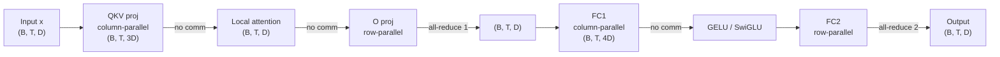
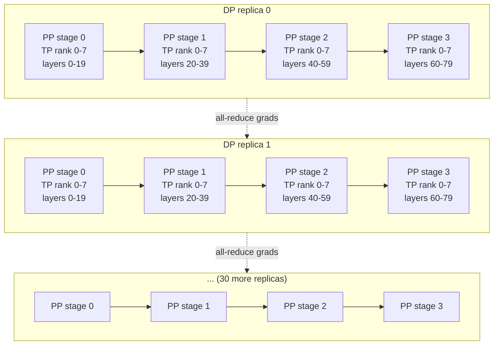

# Chapter 6: Distributed training — TP, PP, DP, CP, EP

> Reading time: ~50 minutes. By the end of this chapter you should be able to read any frontier-lab training-config dump and recognize every parallelism knob, understand why it is set the way it is, and reason about the memory and bandwidth trade-offs that drove it.

*Current as of early 2025.*

## 6.1 The mental model

The single most important fact about frontier training is that **the model does not fit on one GPU, and barely fits on eight.** Everything else in this chapter — tensor parallelism, pipeline parallelism, FSDP, expert parallelism, context parallelism, all the collective-communication primitives — is a response to that fact. So we start with the arithmetic.

A 70B-parameter model in BF16 mixed-precision, trained with AdamW, has the following per-GPU memory cost when held in full on a single device:

| Component | Bytes per param | Total for 70B |
|---|---|---|
| Model weights (BF16) | 2 | 140 GB |
| Gradients (BF16) | 2 | 140 GB |
| Optimizer state, master copy (FP32) | 4 | 280 GB |
| Optimizer state, `m` (FP32) | 4 | 280 GB |
| Optimizer state, `v` (FP32) | 4 | 280 GB |
| **Static total (no activations)** | **16** | **1,120 GB** |
| Activations (varies; see §6.12) | ~1–3 per token | typically 50–300 GB |

The dominant cost is the optimizer state. AdamW keeps two FP32 moment buffers per parameter, plus an FP32 master copy of each parameter, which is what the optimizer step runs against. The BF16 weights are the "compute" copy used in forward and backward; they are converted to/from the FP32 master copy at the start and end of each step. So the per-parameter static cost is $2 + 2 + 4 + 4 + 4 = 16$ bytes.

A single H100 has 80 GB of HBM3. The 1,120 GB static footprint is **14× too large for one GPU**. An 8-GPU H100 node has 640 GB of HBM, which is still only 57% of the static footprint. Eight H100s are *barely* enough if you use 4-bit optimizer state (the technique used in some memory-constrained setups, but not at frontier) and aggressive activation recomputation. The honest answer is: 8 H100s are not enough to train a 70B model with BF16 + AdamW. You need 16, and you need to shard the state.

This is why distributed training exists. The rest of the chapter is about how the state gets sharded.

A useful sanity check. DeepSeek-V3 is a 671B-parameter MoE with 37B parameters active per token [\[1\]](../appendix/b-references.md#1-deepseek-v3). Naive memory cost (if you held all 671B in BF16, ignoring optimizer state and activations): 1.34 TB. Optimizer state in FP32 for the active 37B: 444 GB. The full 671B optimizer state in FP32: 5.4 TB. This is the regime in which no single parallelism strategy is enough; you need three or four of them stacked.

The five parallelism strategies we cover:

- **Data parallelism (DP)** — replicate the model, shard the data, all-reduce gradients. The simplest, but the most memory-hungry per GPU.
- **Tensor parallelism (TP)** — split individual weight matrices across GPUs, all-reduce on activations. Used within a node.
- **Pipeline parallelism (PP)** — split the model layers across GPUs, with micro-batches. Used across nodes.
- **Context parallelism (CP)** — split the sequence dimension across GPUs. Necessary for long-context training.
- **Expert parallelism (EP)** — split the experts of an MoE model across GPUs with all-to-all. Necessary for MoE.

We work through each in turn, then cover the 3D, 4D, and 5D combinations, then the communication-bandwidth analysis, then the activation-recomputation trade-off, then the practical configuration.

## 6.2 Data parallelism

The simplest strategy. Replicate the model on every GPU, give each GPU a different shard of the batch, run forward and backward independently, then all-reduce the gradients before the optimizer step.

```python
# Pseudocode for data-parallel training, naive
for step in range(num_steps):
    batch = next(data_loader)  # global batch, sharded per GPU
    for gpu in gpus:
        loss[gpu] = model[gpu].forward(batch[gpu])
        loss[gpu].backward()
    # All-reduce gradients across gpus, average them
    for p in model.parameters():
        grad = stack([gpu.grad for gpu in gpus])
        grad = all_reduce(grad, op="mean")  # NCCL all-reduce
        for gpu in gpus:
            gpu.p.grad = grad
    # Each GPU runs the optimizer step independently
    for gpu in gpus:
        optimizer.step(model[gpu])
    optimizer.zero_grad()
```

Memory per GPU: the full model, plus full gradients, plus full optimizer state. So for a 70B model, each of 8 GPUs needs 140 GB of HBM just for the static state. That is already more than fits in a single H100 (80 GB). Plain DP is not usable for a 70B model on 8 H100s.

Communication cost: one all-reduce per parameter per step. For a 70B model in BF16, the gradient tensor is 140 GB. The all-reduce sends that tensor twice (ring all-reduce: each GPU sends and receives 140 GB). With 8 GPUs connected by NVLink (~900 GB/s bidirectional per H100), the all-reduce takes roughly $2 \times 140 / 8 \times 900 \approx 0.04$ seconds. That is fast. The bottleneck for plain DP is memory, not communication.

Plain DP is the right strategy for models that *do* fit on a single GPU: most fine-tuning, most post-training, and the smaller pre-training runs (≤13B parameters in 2024 hardware). The moment the model does not fit, you need ZeRO, FSDP, or a tensor/pipeline strategy.

## 6.3 ZeRO: sharding the data-parallel state

ZeRO (Zero Redundancy Optimizer), from Microsoft [\[17\]](../appendix/b-references.md#17-zero), shards the data-parallel state across the DP workers in three stages. Each stage trades off communication against memory.

**ZeRO-1: shard optimizer state.** With DP degree $P$, each GPU holds $\frac{1}{P}$ of the optimizer state and a full copy of the model and gradients. The all-reduce on gradients is unchanged; after the all-reduce, each GPU has the full averaged gradient, but only updates the slice of parameters for which it owns the optimizer state. Then an all-gather broadcasts the updated weights to all GPUs (so every GPU has the full model again for the next step).

Memory saving: optimizer state is $\frac{1}{P}$ of the total. For 70B on 8 GPUs: 560 GB / 8 = 70 GB. With the weights (140 GB) and gradients (140 GB), total is 350 GB per GPU — still too much for one H100, but you have cut the static state from 1,120 GB to 350 GB per GPU.

**ZeRO-2: shard optimizer state and gradients.** Each GPU holds $\frac{1}{P}$ of the gradients as well. The all-reduce is replaced with a reduce-scatter (each GPU gets only the slice of the averaged gradient it needs for its slice of the optimizer state), then an all-gather on the updated weights.

Memory saving: gradients are now also $\frac{1}{P}$. For 70B on 8 GPUs: 140 GB / 8 = 17.5 GB of gradients per GPU. Total static state per GPU: 140 GB (weights, still full) + 17.5 GB (gradients) + 70 GB (optimizer) = 227.5 GB. Still too much for one H100.

**ZeRO-3: shard everything.** Each GPU holds $\frac{1}{P}$ of the weights as well. The forward and backward passes all-gather the weights on demand before each layer's matmul, then discard. The optimizer step is run locally on the local slice of parameters. After the step, all-gather broadcasts the new weights.

Memory saving: weights, gradients, and optimizer state are all $\frac{1}{P}$. For 70B on 8 GPUs: 140/8 + 140/8 + 560/8 = 17.5 + 17.5 + 70 = 105 GB per GPU. Still over 80 GB, but the *marginal* memory is small. With 16 GPUs, the per-GPU cost drops to ~52 GB, which fits. With some activation recomputation, 8 GPUs can work.

The pattern that makes ZeRO-3 usable: weights are *only* all-gathered when needed, and they are released immediately after the matmul. The all-gather cost is one extra communication per layer, but if the all-gather and the matmul can overlap (the all-gather of layer $i+1$ overlaps with the matmul of layer $i$), the marginal time is small. This is the basis of FSDP's prefetching (next section).

ZeRO-3 is what makes >1T-parameter models trainable. The math: a 1.2T model in BF16 has a static state of $1.2 \times 10^9 \times 16$ bytes = 19.2 TB. With 1,024 GPUs, ZeRO-3 puts $19.2 / 1024 \approx 19$ GB per GPU, which is well within a single H100's 80 GB. Without ZeRO-3, the same model would need at least 240 H100s *just* for the static state, with no headroom for activations or other overhead.

## 6.4 FSDP

PyTorch FSDP (Fully Sharded Data Parallel) is the PyTorch-native equivalent of ZeRO-3 [\[18\]](../appendix/b-references.md#18-fsdp). Same idea, integrated into the framework. The user wraps the model in an `FSDP` module, and FSDP handles the all-gather, the reduce-scatter, and the parameter management.

The wrapping pattern:

```python
import torch
from torch.distributed.fsdp import FullyShardedDataParallel as FSDP
from torch.distributed.fsdp import MixedPrecision, BackwardPrefetch

# 1. Define the model normally
model = LlamaForCausalLM(config)

# 2. Define a mixed-precision policy
mp_policy = MixedPrecision(
    param_dtype=torch.bfloat16,        # weights in BF16 for compute
    reduce_dtype=torch.float32,        # gradients in FP32 for the reduce
    buffer_dtype=torch.bfloat16,       # other buffers in BF16
)

# 3. Wrap each transformer block in FSDP
#    This is the standard "per-block" wrapping for transformer training.
def wrap_policy(module, recurse, nonwrapped_numel):
    return recurse or module.__class__.__name__ in {
        "LlamaDecoderLayer", "LlamaAttention", "LlamaMLP"
    }

model = FSDP(
    model,
    sharding_strategy=ShardingStrategy.FULL_SHARD,    # ZeRO-3 equivalent
    mixed_precision=mp_policy,
    backward_prefetch=BackwardPrefetch.BACKWARD_PRE,  # prefetch for backward
    forward_prefetch=True,                            # prefetch for forward
    device_id=torch.cuda.current_device(),
)

# 4. Train normally
for batch in dataloader:
    loss = model(**batch).loss
    loss.backward()
    optimizer.step()
```

The key fields in a frontier FSDP config:

- `sharding_strategy=FULL_SHARD` — ZeRO-3 equivalent. `SHARD_GRAD_OP` is ZeRO-2 equivalent. `NO_SHARD` is plain DP. Frontier training uses `FULL_SHARD` almost exclusively.
- `mixed_precision=MixedPrecision(...)` — the standard pattern is BF16 for the compute (forward/backward of matmuls), FP32 for the gradient reduce (because the all-reduce / reduce-scatter should be in FP32 for numerical stability), and BF16 for other buffers.
- `backward_prefetch=BackwardPrefetch.BACKWARD_PRE` — during the backward pass, FSDP starts the all-gather of the *next* layer's weights while the *current* layer's gradients are still being computed. This hides the communication cost. `BACKWARD_POST` is a less aggressive option.
- `forward_prefetch=True` — same idea, in the forward direction.
- The wrapping policy: per-block wrapping is the standard. Wrapping the entire model in a single FSDP unit is the wrong granularity — it does not allow the all-gather to overlap with compute. Wrapping each individual linear layer is too fine — the per-FSDP-unit overhead dominates. Per transformer block is the sweet spot.

Llama-3 used FSDP for its 16K-GPU training run [\[5\]](../appendix/b-references.md#5-llama-3), as the outermost of four parallelism dimensions: [TP, CP, PP, DP], where DP is FSDP (4D parallelism, see §6.10). The report says FSDP tolerates the slow outer network by prefetching sharded weights and reducing gradients asynchronously. It does not publish a wrapping policy or prefetch setting, so the settings above are the standard recommendation, not Meta's ([fact sheet](../appendix/fact-sheets/llama-3.md#infrastructure-and-parallelism)).

A subtle point about FSDP and the all-gather pattern. FSDP is a *communication-compute overlap* pattern. The all-gather of layer $i+1$'s weights happens while layer $i$'s matmul is running. The matmul of layer $i+1$ then proceeds. The all-gather and the matmul of two different layers run on the same GPU concurrently, and the all-gather bandwidth is "free" as long as the matmul is compute-bound. For a 70B model on H100s, the matmul is large enough that this overlap works well. For smaller models, the matmul is too fast and the all-gather dominates.

## 6.5 Tensor parallelism

Tensor parallelism splits individual weight matrices across GPUs. The standard pattern, from the Megatron-LM paper [\[3\]](../appendix/b-references.md#3-megatron-lm), is to split the column dimension of one linear layer and the row dimension of the next, so that the two all-reduces cancel out across the two layers.

Consider a transformer block with two linear layers in the FFN:

```python
# Naive: single GPU
y = x @ W1     # (B, T, D) @ (D, 4D) -> (B, T, 4D)
y = gelu(y)
y = y @ W2    # (B, T, 4D) @ (4D, D) -> (B, T, D)
```

Now split each linear layer across $P$ GPUs along the output dimension (column-parallel for the first, row-parallel for the second):

```python
# Column-parallel: W1 split column-wise into P pieces
#   GPU i holds W1_i of shape (D, 4D/P)
#   y_i = x @ W1_i  -> (B, T, 4D/P) on each GPU
#   No all-reduce needed; each GPU holds a disjoint slice of the 4D output.

# Row-parallel: W2 split row-wise into P pieces
#   GPU i holds W2_i of shape (4D/P, D)
#   z_i = y_i @ W2_i  -> (B, T, D) on each GPU
#   One all-reduce of z across GPUs.
```

The same pattern works for the attention block. Q, K, V projections are column-parallel (split along the head dimension, so each GPU owns a subset of attention heads). The output projection is row-parallel. The attention computation is local to each GPU (each GPU computes its own heads). The all-reduce happens at the end.

The transformer block in tensor-parallel form, with $P$ GPUs:



Two all-reduces per transformer block, both on a tensor of shape (B, T, D). For a 70B model with D=8192, B=1, T=8192, the all-reduce is on 8192 × 8192 × 2 = 128 MB per block. With 80 blocks, total all-reduce traffic per step is 80 × 2 × 128 MB = 20 GB per step (in each direction). At 900 GB/s NVLink bandwidth, the all-reduce takes ~22 ms. The actual matmul takes much longer, so the all-reduce is overlapped.

Tensor parallelism is limited to within a node, because the all-reduce is in the critical path of every layer. The bandwidth requirement is roughly $2 \times \text{model dimension} \times \text{seq length} \times \text{bytes per element}$ per layer, which for frontier models is tens of GB per step. NVLink provides ~900 GB/s; InfiniBand provides ~50–100 GB/s. The all-reduce is bandwidth-bound, and the latency kills you on InfiniBand. So TP stays within a node (8 GPUs), and longer-range parallelism is handled by PP and DP.

## 6.6 Pipeline parallelism

Pipeline parallelism splits the model layers across GPUs. Each GPU holds a contiguous range of layers (e.g., GPU 0 holds layers 0–9, GPU 1 holds layers 10–19, etc.). During the forward pass, GPU 0 computes layers 0–9, sends the activations to GPU 1, GPU 1 computes layers 10–19, sends to GPU 2, etc.

The naive version has a problem: only one GPU is working at a time. The "warmup" and "cooldown" regions of the pipeline are idle. The fix is to split the batch into *micro-batches* and overlap their execution. The standard terminology: the global batch is split into $M$ micro-batches, each of size $B/M$. Each micro-batch flows through the pipeline independently, and the pipeline fills with $P$ micro-batches (where $P$ is the pipeline depth).

### GPipe

The original schedule, from Google [\[3\]](../appendix/b-references.md#3-megatron-lm). All micro-batches flow through the pipeline one at a time. Every micro-batch is in flight in the forward direction before any of them is in the backward direction. This means the activations for *all* $M$ micro-batches must be stored in HBM, which is the dominant memory cost of the GPipe schedule.

The "bubble" is the fraction of time the pipeline is not fully utilized. For $P$ stages and $M$ micro-batches, the bubble is $\frac{P - 1}{M + P - 1}$. With $P = 4$ and $M = 32$, the bubble is $\frac{3}{35} \approx 8.6\%$. With $P = 8$ and $M = 32$, the bubble is $\frac{7}{39} \approx 18\%$. The bubble scales as $O(P / M)$ — to keep it small, you need $M \gg P$.

### 1F1B (one-forward-one-backward)

The standard modern schedule, also from Megatron [\[3\]](../appendix/b-references.md#3-megatron-lm). After a warmup of $P$ micro-batches in the forward direction, the schedule alternates forward and backward of one micro-batch at a time. Each GPU does one forward, one backward, one forward, one backward, etc.

The advantage: only the activations for the in-flight micro-batches need to be stored, not all $M$ of them. Specifically, the number of in-flight micro-batches is $P$, so the activation memory is $P \times$ (per-micro-batch activation cost), not $M \times$.

The disadvantage: the bubble is the same as GPipe's, but the schedule is harder to implement. The implementation has to coordinate the forward and backward passes of different micro-batches across the pipeline.

### Interleaved 1F1B

A refinement from Megatron-V3 (2021). Instead of each GPU holding $L/P$ contiguous layers, each GPU holds $L/P$ layers in *non-contiguous* "virtual stages," and the schedule interleaves micro-batches across multiple virtual stages per GPU. The bubble drops to $\frac{P - 1}{M \cdot V + P - 1}$ where $V$ is the number of virtual stages per GPU, but the communication volume increases (each GPU now sends and receives activations $V$ times per step instead of once). This is a useful option when $P$ is small and you want to reduce the bubble further.

### The activation memory trade-off

All three schedules trade off activation memory against bubble. GPipe uses $O(M \times \text{activation})$ memory and has the same bubble. 1F1B uses $O(P \times \text{activation})$ memory, which is much less. Interleaved 1F1B reduces the bubble at the cost of more communication. The standard frontier choice is 1F1B with $M$ large enough that the bubble is <10%.

For a 70B model with 80 layers, $P = 4$ (so 20 layers per stage), $M = 32$ (micro-batches per step), the bubble is $\frac{3}{35} \approx 8.6\%$. The activation memory per stage is $4 \times$ the per-micro-batch activations. If each micro-batch has sequence length 2048 and batch size 1, the per-stage activation memory at full precision is $80 \text{ layers} / 4 \text{ stages} \times 2048 \times 8192 \times 2 \text{ bytes} \times \text{number of stored tensors}$. This is dominated by the attention activations and the FFN inputs. A modern frontier run uses selective activation recomputation to reduce this further (§6.12).

```mermaid
sequenceDiagram
    participant G0 as GPU 0 (layers 0-19)
    participant G1 as GPU 1 (layers 20-39)
    participant G2 as GPU 2 (layers 40-59)
    participant G3 as GPU 3 (layers 60-79)
    Note over G0,G3: Warmup: each GPU does P forward passes
    G0->>G1: F0
    G0->>G1: F1
    G0->>G1: F2
    G1->>G2: F0
    G1->>G2: F1
    G1->>G2: F2
    G2->>G3: F0
    G2->>G3: F1
    G2->>G3: F2
    Note over G0,G3: Steady state: 1F1B
    G3->>G2: B0
    G2->>G1: B0
    G1->>G0: B0
    G0->>G1: F3
    G1->>G2: F3
    G2->>G3: F3
    G3->>G2: B1
    ...
```

The bubble is visible as the empty corners of the diagram.

## 6.7 Context parallelism

The most recent of the parallelism strategies, driven by the move to long contexts. When training a model on 128K-token sequences, even a single sequence does not fit in the memory of one GPU for the attention computation: the attention matrix is $128K \times 128K = 16G$ entries, which at 2 bytes is 32 GB, just for one layer.

Context parallelism (CP) splits the sequence dimension across GPUs. Each GPU holds a slice of length $S/P$ (where $S$ is the total sequence length and $P$ is the CP degree). The challenge: standard attention requires each query token to attend to all key/value tokens, which means every GPU needs the full K/V sequence to compute its queries' attention output.

The standard solution is **Ring Attention** [\[38\]](../appendix/b-references.md#38-ring-attention) (Liu et al. 2023). The K/V blocks are passed around a ring of GPUs, and each GPU computes its queries' attention against successive K/V blocks as they arrive. The all-gather of K/V is overlapped with the attention computation, so the marginal time is small.

The memory savings: each GPU holds only $1/P$ of the Q, K, V tensors. For a 128K-token sequence with D=8192, the per-token K/V cost is $2 \times 2 \times 8192 = 32K$ bytes. The full K/V is $128K \times 32K = 4$ GB per layer. With 80 layers and 8-way CP, each GPU holds $4 / 8 = 0.5$ GB per layer, or 40 GB total — well within HBM.

CP is necessary when the sequence length × model dimension × layer count exceeds the per-GPU memory budget. For 8K-token sequences, plain attention fits in HBM with the help of FlashAttention, and CP is not needed. For 128K-token sequences, CP is necessary. For 1M-token sequences, CP is mandatory.

Ring Attention's overhead is the ring communication. Each K/V block is passed around the ring once, so the total communication per step is $P \times \text{per-GPU K/V} \times \text{layers}$. For 128K context with 8-way CP, this is $8 \times 0.5 \text{ GB} \times 80 = 320$ GB per step. At 100 GB/s InfiniBand, this is 3.2 seconds per step. The matmul for the attention is faster, so the comm dominates. The saving grace: the K/V transfer overlaps with the attention computation of the previous block, so the marginal cost is the latency of the longest single transfer, not the total.

## 6.8 Expert parallelism

Expert parallelism (EP) is specific to MoE models. The experts are sharded across GPUs, and tokens are routed to their assigned expert via an all-to-all collective.

Consider a 256-expert MoE layer with top-2 routing. Each token is sent to 2 of the 256 experts. The naive approach: replicate all 256 experts on every GPU, route tokens locally. This wastes memory (every GPU holds all 256 experts) and compute (every GPU runs the matmul against all 256 experts, even though only 2 are used by any given token).

The EP approach: split the 256 experts across $E$ GPUs, so each GPU holds $256/E$ experts. To route a token to expert $e$, the token's data must be all-to-all'd to the GPU that holds expert $e$. After the expert runs, the result is all-to-all'd back.

The communication cost: each token's activation is sent and received twice (once for each of the top-2 experts). For a batch of $B$ tokens, the all-to-all sends $B \times 2 \times \text{per-token-activation-bytes}$ in each direction. For a 70B MoE with hidden dim 8192, per-token activation is 32 KB. For a global batch of 4M tokens (a typical frontier micro-batch is much smaller, but consider the total), the all-to-all is $4M \times 2 \times 32KB \times 2 = 512 GB$ per step. At 100 GB/s InfiniBand, this is ~5 seconds per step. The all-to-all is bandwidth-bound, and the bandwidth is the limiting factor.

The DeepSeek-V3 paper [\[1\]](../appendix/b-references.md#1-deepseek-v3) introduces **DualPipe**, a custom pipeline schedule that overlaps the all-to-all of one micro-batch with the attention and FFN computation of another. The all-to-all is the dominant communication cost of EP, and DualPipe is the technique that hides it. The DeepSeek team reports that DualPipe is essential to achieving their reported throughput on the 2,048 H800 cluster.

A subtlety: the all-to-all is *not* a balanced communication pattern. Different experts receive different numbers of tokens, depending on the routing. This means some GPUs send and receive more than others, and the all-to-all is bottlenecked by the busiest GPU. The DeepSeekMoE design mitigates this with the auxiliary-loss-free load balancing (§1.4 of Chapter 1), which keeps the expert loads roughly uniform. Without good load balancing, the all-to-all is unbalanced and the slowest GPU determines the step time.

Pseudocode for the all-to-all in EP:

```python
# Each GPU has a list of (token_id, expert_id, activation) for its micro-batch
# Step 1: sort tokens by expert_id, group by destination GPU
def dispatch(local_tokens, expert_to_gpu):
    # local_tokens: list of (token_id, expert_id, activation)
    # expert_to_gpu: dict expert_id -> gpu_id
    send_buffers = defaultdict(list)
    for tok in local_tokens:
        dst = expert_to_gpu[tok.expert_id]
        send_buffers[dst].append(tok)
    # All-to-all: send send_buffers[dst] to GPU dst, receive from all other GPUs
    received = all_to_all(send_buffers)
    return received  # list of (token_id, expert_id, activation) on this GPU

# Step 2: run the local experts on the received tokens
def run_experts(received_tokens, local_experts):
    # Group by expert_id, run each expert
    outputs = {}
    for tok in received_tokens:
        e = tok.expert_id
        if e not in outputs:
            outputs[e] = local_experts[e].forward([])
        outputs[e].append(tok)
    for e, expert in local_experts.items():
        outputs[e] = expert.run()  # the matmul
    return outputs

# Step 3: all-to-all the expert outputs back to the original GPUs
def combine(outputs, send_buffers_inverse):
    # send_buffers_inverse is the inverse of the dispatch mapping
    return all_to_all(outputs)
```

This is roughly the pattern in Megatron-LM's MoE implementation and in DeepSeek's DualPipe.

## 6.9 3D parallelism

3D parallelism is the combination of TP, PP, and DP. It is the standard configuration for dense frontier models (Llama-3, Qwen3 dense) and the basis for MoE configurations (DeepSeek-V3, Qwen3 MoE).

An illustrative Megatron-style 3D parallelism config for a 70B dense model on 1,024 H100s (not any lab's file):

```yaml
# ILLUSTRATIVE: not any lab's file. A 70B dense model on 1,024 H100s.
# model
num_layers: 80
hidden_size: 8192
num_attention_heads: 64
num_query_groups: 8                  # GQA: 1 KV head per 8 Q heads
ffn_hidden_size: 28672
seq_length: 8192
# parallelism
tensor_model_parallel_size: 8        # TP = 8, fits one H100 node
pipeline_model_parallel_size: 4      # PP = 4, splits the 80 layers as 20/20/20/20
num_layers_per_virtual_pipeline_stage: null  # 1F1B, not interleaved
context_parallel_size: 1             # CP = 1, sequence length is 8K
# data
micro_batch_size: 1
global_batch_size: 1024
# precision
bf16: true
fp8: true
fp8_e4m3: true
fp8_e5m2: false
# optimizer
optimizer: adam
adam_beta1: 0.9
adam_beta2: 0.95
adam_eps: 1.0e-8
weight_decay: 0.1
grad_clip_val: 1.0
# schedule
lr: 3.0e-4
min_lr: 3.0e-5
lr_decay_style: cosine
lr_warmup_iters: 2000
train_iters: 1200000
```

With TP=8, PP=4, the total GPUs per model replica is $8 \times 4 = 32$. With 1,024 H100s, the DP degree is $1024 / 32 = 32$. The full configuration is $8 \text{ (TP)} \times 4 \text{ (PP)} \times 32 \text{ (DP)} = 1024$ GPUs.

The memory budget per GPU (ZeRO-1, optimizer state sharded across DP=32):

- Weights: 140 GB / 8 (TP) = 17.5 GB in BF16
- Gradients: 140 GB / 8 (TP) / 32 (DP-ZeRO-1) = 0.55 GB
- Optimizer state: 560 GB / 8 (TP) / 32 (DP-ZeRO-1) = 2.2 GB
- Activations: dominated by per-layer activations × micro-batch × seq length; with 1F1B and selective recomputation, ~30–60 GB
- Total: ~50–80 GB, which fits in 80 GB HBM with some headroom

The placement matters. The 32 GPUs of a model replica should be within a small number of nodes, so the TP all-reduce can use NVLink. With TP=8, that means one model replica per 8-GPU node. The PP=4 means 4 consecutive nodes form a pipeline. The DP=32 means there are 32 such pipeline-of-nodes "rows" in the cluster.

A diagram of the 3D parallel layout (4 PP stages × 8 TP ranks per stage, replicated 32 times via DP):



Each "PP stage" box is a full 8-GPU node, internally connected by NVLink. The horizontal arrows (within a replica) are the pipeline activations, sent over InfiniBand. The vertical arrows (between replicas) are the data-parallel all-reduces, also over InfiniBand.

## 6.10 4D and 5D parallelism

When the model is MoE or the context is long, you add the missing parallelism dimensions.

**4D parallelism = TP × PP × DP × CP.** Used for dense models trained on long contexts. For example, a 70B model on 32K-token sequences with CP=4 would split each 32K sequence into four 8K chunks, one per GPU. The TP and PP remain as in 3D; the DP degree is reduced to keep the total GPU count constant.

**4D parallelism = TP × PP × DP × EP.** Used for MoE models with sequences that fit on one GPU. The EP dimension shards the experts; the all-to-all is the dominant communication. DeepSeek-V3 (next) uses three of the four and drops TP entirely.

**5D parallelism = TP × PP × DP × CP × EP.** The full combination for long-context MoE. Used by some frontier labs but not yet standard in the public literature.

### DeepSeek-V3: 16-way PP × 64-way EP × ZeRO-1 DP, no TP

DeepSeek-V3 was trained on 2,048 H800 GPUs with the following parallelism [\[1\]](../appendix/b-references.md#1-deepseek-v3) ([fact sheet](../appendix/fact-sheets/deepseek-v3.md#parallelism-layout)):

- **PP = 16**: the 61 transformer layers are split across 16 pipeline stages.
- **EP = 64, spanning 8 nodes**: each layer's 256 routed experts are spread evenly over 64 GPUs (4 per GPU). The all-to-all that routes tokens to their experts crosses InfiniBand.
- **DP: ZeRO-1**, sharding the optimizer state across data-parallel ranks. The report does not state the DP degree; with 16 pipeline stages on 2,048 GPUs, each stage has $2{,}048 / 16 = 128$ ranks.
- **TP = 1 everywhere**: no tensor parallelism at all. DeepSeek report that memory optimizations (recomputing RMSNorm and the MLA up-projections, keeping the EMA of parameters in CPU memory, sharing the embedding and output head with the MTP module) let them avoid it.
- **DualPipe**: the pipeline schedule overlaps the computation and the communication of paired forward and backward chunks, hiding the cross-node EP all-to-all behind compute.

This layout breaks the rule of thumb in §6.11, and the reason is worth understanding. With EP spanning 8 nodes, the all-to-all runs mostly on InfiniBand, which on DeepSeek's H800 cluster is about 3.2× slower than NVLink (50 vs 160 GB/s). DeepSeek made that affordable in two ways. **DualPipe** overlaps the all-to-all with compute. **Node-limited routing** sends each token to at most 4 nodes: a token crosses InfiniBand once per target node, then fans out over NVLink to the GPUs holding its experts. Wide EP buys large per-expert batches and no TP; the price is the co-designed schedule and kernels.

A rough per-GPU parameter budget for this layout. It is our arithmetic, not a figure from the report:

- **Routed experts** are almost all of the model: 58 MoE layers × 256 experts × 3 matrices × 7,168 × 2,048 ≈ 654B of the 671B parameters. They are split 16 ways by PP and 64 ways by EP, so each GPU holds about $654\text{B} / (16 \times 64) \approx 0.64\text{B}$ expert parameters.
- **Everything else** (attention, the shared experts, the 3 dense layers, embeddings), about 17B, is split only by PP: roughly $17\text{B} / 16 \approx 1.1\text{B}$ per GPU. Stages are uneven in practice, because the embedding and output head sit on the end stages.
- That is **~1.7B parameters per GPU, ~3.5 GB in BF16**, before optimizer state (sharded by ZeRO-1; precision in §8.7), gradients and activations.

Every optimizer step updates **all** 671B parameters. Each one has its own AdamW state, and an expert that received no tokens in a step still has a (zero-gradient) update. The point of the exercise is that wide EP plus PP makes the *parameters* small per GPU. What DeepSeek had to engineer was the activation memory and the communication, not the weights.

## 6.11 The cost of communication

The different parallelism strategies have very different communication profiles. The frontier is dominated by three network tiers:

- **NVLink**: ~900 GB/s bidirectional per H100 (NVLink 4.0). Within a node, 8 GPUs share ~900 GB/s to the outside (the "NVSwitch" bandwidth). Effective per-GPU bandwidth: ~450 GB/s for collectives.
- **InfiniBand HDR**: ~25 GB/s per link (200 Gbps). A typical frontier node has 8 such links, for ~200 GB/s outbound per node.
- **InfiniBand NDR**: ~50 GB/s per link (400 Gbps). A typical Blackwell-era node has 8 such links, for ~400 GB/s outbound per node.
- **Ethernet (100 GbE)**: ~12.5 GB/s per link. Common at smaller labs and for non-critical paths.

The communication volume per step for each strategy:

| Strategy | Volume per step | Frequency | Bandwidth tier required |
|---|---|---|---|
| DP (plain, no sharding) | $2 \times \text{model size}$ in BF16 | once per step | InfiniBand OK for ≤13B |
| ZeRO-3 / FSDP | $3 \times \text{model size}$ | once per step (in the limit) | InfiniBand OK |
| TP | $2 \times \text{layer count} \times \text{seq} \times \text{hidden} \times \text{bytes}$ per step | per layer per step | NVLink required |
| PP | $2 \times \text{micro-batch count} \times \text{activation size}$ | per stage per step | InfiniBand OK |
| CP (Ring Attention) | $P \times \text{KV per layer}$ per step | per layer per step | InfiniBand OK at CP=8 |
| EP (all-to-all) | $2 \times \text{token count} \times \text{per-token activation}$ | per layer per step | NVLink preferred; cross-node only with overlap and routing limits |

The arithmetic intensity (bytes of communication per FLOP of compute) determines which strategy is bandwidth-bound and which is compute-bound. The pattern:

- TP has high arithmetic intensity per all-reduce (the matmul that follows is large), so the all-reduce is overlapped with compute. TP requires NVLink.
- PP has low communication per step (one activation transfer per micro-batch per stage), but high latency sensitivity (the bubble depends on the stage-to-stage latency). PP works on InfiniBand.
- CP has medium arithmetic intensity. The K/V transfer per layer is small relative to the attention matmul. CP works on InfiniBand for moderate $P$, on NVLink for large $P$.
- EP has low arithmetic intensity (the all-to-all is bandwidth-bound, and the expert matmul is small relative to the all-to-all). By default it wants NVLink. DeepSeek-V3 is the instructive exception: its EP spans 8 nodes, and it pays for InfiniBand with DualPipe overlap and by sending each token to at most 4 nodes (§6.10).

The topology-aware placement is the consequence. In a frontier cluster, the 8 GPUs of a node are connected by NVLink. TP is placed within a node, and so is EP by default (V3 shows the cost of doing otherwise, and how to pay it). PP and DP are placed across nodes, with consecutive PP stages on nodes that are topologically close (same InfiniBand rail) to minimize the activation transfer latency. CP can be either, depending on the context length.

## 6.12 Activation recomputation

The other lever for fitting the model in HBM is activation recomputation (also called gradient checkpointing). The idea: during the forward pass, do not store all the intermediate activations. Instead, store only a subset, and recompute the rest during the backward pass.

There are three levels:

**Full recomputation.** Store only the input of each transformer block. During the backward pass, re-run the entire block's forward to recompute the activations. The memory savings: only 1× the input activation per block, instead of 10–20×. The compute cost: ~33% extra FLOPs (the backward pass already has a 2× compute factor relative to forward; the recomputation adds another forward pass, so total is ~3× forward, vs the standard 2×).

**Selective recomputation.** Recompute only the *cheap* activations, not all of them. The Korthikanti 2022 paper [\[39\]](../appendix/b-references.md#39-korthikanti-2022-activation-recomputation) analyzes the cost of recomputing each individual activation in a transformer block and finds that recomputing the dropout, layer-norm, and the linear-layer outputs (the matmul outputs) recovers most of the memory savings of full recomputation at a small compute cost. The standard recipe in Megatron-LM is "selective layer-norm recomputation" + "selective dropout recomputation" + "recompute the matmul outputs of the FFN." This typically saves 60–70% of the activation memory at a cost of 5–10% extra FLOPs.

**No recomputation.** Store everything. Used only for small models or short sequences where memory is not the bottleneck.

The standard frontier choice is **selective recomputation**. Full recomputation is used when memory is severely constrained; no recomputation is used for small models or short sequences. The Megatron-LM codebase implements all three, and the choice is a config flag.

Pseudocode for selective recomputation:

```python
class TransformerBlockWithRecompute(nn.Module):
    def __init__(self, config):
        self.attn = Attention(config)
        self.mlp = MLP(config)
        self.norm1 = RMSNorm(config.d_model)
        self.norm2 = RMSNorm(config.d_model)

    def forward(self, x):
        # Store: x (input), attn_output_pre_norm (post-norm1)
        # Recompute during backward: dropout mask, attention probabilities
        x_norm = self.norm1(x)
        attn_out = checkpoint(  # recompute the attention internals
            self.attn, x_norm, use_reentrant=False
        )
        x = x + attn_out

        x_norm = self.norm2(x)
        # Recompute the FFN matmul outputs (the cheap recomputation)
        mlp_out = checkpoint(
            self.mlp, x_norm, use_reentrant=False
        )
        x = x + mlp_out
        return x
```

The `checkpoint` wrapper from `torch.utils.checkpoint` is the standard PyTorch primitive. The `use_reentrant=False` argument is the modern API.

## 6.13 Configuration in practice

The choice of TP, PP, and DP sizes is governed by a small set of constraints. The worked example, for a 70B model on 1,024 H100s:

1. **TP = 8, one model replica per 8-GPU node.** This puts the TP all-reduce on NVLink, where the bandwidth is high. The TP choice is fixed by the node size.
2. **PP = 4, four consecutive nodes form a pipeline.** This keeps the pipeline depth small (4 stages), so the bubble is small. The 80 layers split as 20/20/20/20. With $M = 32$ micro-batches, the bubble is $\frac{3}{35} \approx 8.6\%$.
3. **DP = 32, 32 replicas of the (TP=8, PP=4) configuration.** This is the remaining factor: $1024 / (8 \times 4) = 32$.
4. **Micro-batch = 1, global batch = 1024.** With DP=32, the per-replica batch is $1024 / 32 = 32$. With $M = 32$ micro-batches per replica, the micro-batch size is 1.
5. **ZeRO-1 (optimizer state sharding across DP).** This is a Megatron convention. The 560 GB of optimizer state is sharded across DP=32, giving 17.5 GB per GPU, well within HBM.
6. **Selective activation recomputation.** Reduces per-stage activation memory by 60–70%.

The trade-off when picking TP and PP:

- **Larger TP** means more GPUs per replica, less DP, more all-reduce traffic (but on NVLink). Memory per GPU is lower (the model is split more ways). But TP is limited to within a node, so TP is at most 8.
- **Larger PP** means deeper pipeline, larger bubble (unless $M$ is increased proportionally), more activation memory per stage (fewer layers per stage means more activations to store across the whole model). But PP can cross node boundaries.
- **Larger DP** means more replicas, more all-reduce traffic (on InfiniBand), but each replica's memory is unchanged. Communication is the only cost.

The standard frontier practice is to push DP as high as possible, then add PP to keep the per-replica memory in budget, then add TP to keep the per-GPU memory in budget. CP and EP are added when the model architecture or context length requires them.

For DeepSeek-V3 on 2,048 H800s ([fact sheet](../appendix/fact-sheets/deepseek-v3.md#parallelism-layout)), the logic runs differently, because MoE changes which dimension is expensive:

- PP = 16
- EP = 64, spanning 8 nodes (so the all-to-all crosses InfiniBand, hidden by DualPipe)
- DP: ZeRO-1 across the remaining ranks
- No TP anywhere

For Llama-3 on 16K H100s [\[5\]](../appendix/b-references.md#5-llama-3):

- TP = 8 (within a node)
- PP = 16 (across 16 nodes)
- DP = 128, implemented as FSDP
- Total: $8 \times 16 \times 128 = 16{,}384$ GPUs
- CP = 1 at the 8K pre-training length
- For the long-context stage, the same 16,384 GPUs switch to CP = 16 with DP = 8, at 131,072-token sequences ($8 \times 16 \times 16 \times 8 = 16{,}384$)

Both layouts are rows of the report's Table 4 ([fact sheet](../appendix/fact-sheets/llama-3.md#infrastructure-and-parallelism)). Context parallelism is what Llama-3 adds for long context, not something it avoids.

The two runs share PP=16, and the difference lies in the other dimensions. Llama-3's 405B model is dense, so every layer's full weight matrices sit on the devices that compute them, and TP=8 inside a node is what makes each layer fit. DeepSeek-V3's weights are mostly routed experts, which EP already splits 64 ways, so it can drop TP entirely. The bubble is $\frac{15}{M + 15}$; with $M = 64$, the bubble is $\frac{15}{79} \approx 19\%$. Llama-3 trades off a larger bubble for a smaller per-replica memory footprint, and the per-FLOP cost of the bubble is compensated by the throughput of running on 16K GPUs.

## 6.14 The JD, decoded

What "Large-Scale Training Engineer" or "Distributed Systems Engineer" means in practice, mapped to this chapter:

| Component of the chapter | What the engineer does |
|---|---|
| Memory math | Sizes the model against the cluster, picks the parallelism dimensions |
| DP and ZeRO | Maintains the FSDP or DeepSpeed config, tunes the mixed-precision policy, fixes all-reduce hangs |
| TP | Implements column-parallel and row-parallel layers, debugs the all-reduce, tunes the NVLink placement |
| PP | Implements the 1F1B or interleaved schedule, manages the activation memory, fixes the bubble |
| CP | Implements ring attention, tunes the K/V block size, fixes the ring communication |
| EP | Implements the MoE all-to-all, designs the routing-aware load balancing, writes the custom kernel for the dispatch/combine |
| 3D / 4D / 5D | Combines the parallelism strategies, designs the cluster placement, tunes the topology-aware scheduling |
| Communication | Profiles the all-reduce, all-gather, all-to-all, identifies bandwidth bottlenecks, picks the InfiniBand topology |
| Activation recomputation | Implements selective recomputation, tunes which activations to recompute, profiles the memory vs compute trade-off |

This is one of the deepest roles in a frontier lab. A senior engineer in this role typically owns the entire training stack from the model definition down to the NCCL tuning. The interview loop includes questions on all of the above.

## 6.15 What you should take from this chapter

1. **The memory wall is real.** A 70B model in BF16 + AdamW needs ~1 TB of static state per replica, which does not fit in a single H100 and barely fits in an 8-GPU node. The 14× oversubscription is the reason distributed training exists.
2. **The five parallelism strategies trade off different things.** DP scales the data, TP scales the matmul, PP scales the layers, CP scales the sequence, EP scales the experts. The right combination depends on the model architecture and the context length.
3. **ZeRO / FSDP is the default for dense models.** It shards the data-parallel state and is the cleanest way to fit a >13B model in HBM. Llama-3 used FSDP for 16K GPUs.
4. **TP is limited to within a node.** The all-reduce is in the critical path of every layer, and only NVLink has the bandwidth.
5. **PP is the cross-node lever.** It introduces a bubble, which scales as $O(P / M)$. 1F1B is the standard schedule; selective activation recomputation is the standard memory reducer.
6. **CP is necessary for long contexts.** Ring Attention (Liu et al. 2023) splits the sequence across GPUs with a ring-style K/V transfer. For 128K contexts, CP is mandatory.
7. **EP is the MoE lever.** The all-to-all is the dominant cost, and DeepSeek's DualPipe hides it by overlapping with attention and FFN compute.
8. **The frontier uses 3D, 4D, and 5D parallelism.** Llama-3: TP=8 × PP=16 × DP=128 at 8K, and TP=8 × CP=16 × PP=16 × DP=8 at 128K ([fact sheet](../appendix/fact-sheets/llama-3.md#infrastructure-and-parallelism)). DeepSeek-V3: PP=16 × EP=64 (across 8 nodes) × ZeRO-1 DP, with no TP ([fact sheet](../appendix/fact-sheets/deepseek-v3.md#parallelism-layout)). The combinations are tuned to the model and the cluster.
9. **Communication bandwidth drives the topology.** NVLink for TP, InfiniBand for PP and DP. EP prefers NVLink, but DeepSeek-V3 runs it across 8 nodes and pays for that with DualPipe overlap and node-limited routing. The placement of the parallelism dimensions is not arbitrary, and sometimes the right move is to break the default on purpose.
10. **Activation recomputation is the third lever.** Selective recomputation (Korthikanti 2022) is the standard frontier choice: it recovers 60–70% of the activation memory at a cost of 5–10% extra FLOPs.

The next chapter covers the cluster reality: the actual hardware, the InfiniBand topology, the failure modes, the checkpointing, and the monitoring that turns a working training job into a working training *run*.

---

**Exercises:** [Chapter 6 problem set](../../exercises/ch06.md) — includes the parallelism-sizing problem and the what-actually-gets-all-reduced question.
**Lab:** [`lab06_parallelism_memory_model`](../../labs/lab06_parallelism_memory_model.py) — a memory-and-throughput calculator for dense and MoE models under any TP/PP/EP/DP/ZeRO configuration.

---

**References for this chapter**

- [\[1\] DeepSeek-V3 Technical Report](../appendix/b-references.md#1-deepseek-v3) — DeepSeek-AI, December 2024. The 671B MoE with 16-way PP × 64-way EP (across 8 nodes) × ZeRO-1 DP, no TP × 64-way DP on 2,048 H800s, with the DualPipe schedule.
- [\[3\] Megatron-LM](../appendix/b-references.md#3-megatron-lm) — Shoeybi et al., 2019. The original 3D parallelism paper; the basis for TP, PP, and the 1F1B schedule.
- [\[5\] Llama 3 Herd of Models](../appendix/b-references.md#5-llama-3) — Meta AI, July 2024. The 16K-GPU 4D-parallel training (FSDP as the DP dimension), and its Table 4 layouts.
- [\[17\] ZeRO](../appendix/b-references.md#17-zero) — Rajbhandari et al., SC20. The sharded data-parallel paper; the basis for DeepSpeed and the conceptual foundation for FSDP.
- [\[18\] PyTorch FSDP](../appendix/b-references.md#18-fsdp) — Zhao et al., VLDB 2023. The PyTorch-native ZeRO-3 equivalent.
- [\[38\] Ring Attention](../appendix/b-references.md#38-ring-attention) — Liu, Zaharia, Abbeel, NeurIPS 2023. The context-parallelism algorithm.
- [\[39\] Korthikanti 2022 (activation recomputation)](../appendix/b-references.md#39-korthikanti-2022-activation-recomputation) — The selective activation recomputation analysis.
- [See full reference list](../appendix/b-references.md)
