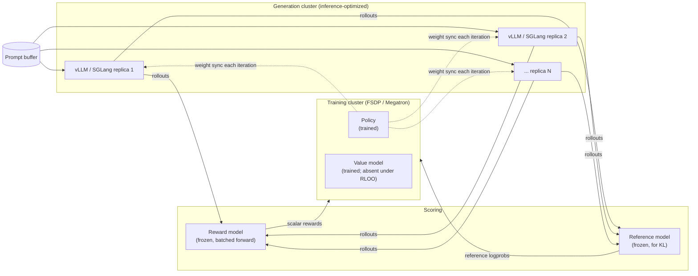

# Chapter 13: PPO and RLOO at frontier scale

> Reading time: ~45 minutes. This is a densely technical chapter; skim it on a first pass if you need to. By the end you should understand the RLHF objective and why it has a KL term, how PPO's clipped surrogate works and what its four-model memory footprint costs, why RLOO deletes the value network and gets away with it, and why a production RLHF system is mostly an inference-serving problem wearing a training-job costume.

## 13.1 The step from a scorer to a policy

Chapter 12 gave you $r(x, y)$: a function that scores a response. Chapter 11 §11.10 showed the cheapest way to use it — sample $k$ responses, keep the best, retrain. That is rejection sampling, and it works.

Reinforcement learning is the expensive way, and the question worth answering before any of the machinery is *what you get for the expense*.

Rejection sampling throws away $k-1$ of every $k$ samples. It learns nothing from the bad ones except that they lost. And it only ever trains on responses the model already produced, so its ceiling is "the best thing the model does sometimes."

Policy-gradient RL uses every sample. A response scoring below average pushes probability mass *away* from itself; a response scoring above average pulls mass toward itself. The gradient carries the magnitude of how good or bad, not just a ranking. And because the update is applied continuously, the policy moves into regions it did not previously sample from.

That is the payoff. The cost is four models in memory, a generation loop in the middle of your training loop, and an objective that will find every flaw in your reward model (§12.6). This chapter is about paying that cost correctly.

## 13.2 The objective

The RLHF objective, as it appears in InstructGPT [\[12\]](../appendix/b-references.md#12-instructgpt) and essentially everything since:

$$\max_{\pi_\theta} \; \mathbb{E}_{x \sim \mathcal{D},\; y \sim \pi_\theta(\cdot|x)} \Big[ r(x, y) \Big] \;-\; \beta \, \mathbb{D}_{\mathrm{KL}}\Big[ \pi_\theta(y|x) \,\|\, \pi_{\mathrm{ref}}(y|x) \Big]$$

Two terms.

**The reward term** says: produce responses the reward model scores highly.

**The KL term** says: do not drift far from the reference policy, which is the SFT model you started from. $\beta$ is the price of drift.

The KL term is not a regularization nicety. It is the mechanism that keeps you left of the overoptimization peak from §12.6. Gao et al. [\[56\]](../appendix/b-references.md#56-reward-model-overoptimization) showed the gold reward is well described as a function of the KL divergence from the initial policy — so the KL is literally the budget you are spending, and $\beta$ is how fast you spend it.

Set $\beta = 0$ and the policy will find whatever maximizes the reward model. In practice this means it collapses: it discovers some specific phrasing the reward model loves and emits variants of it for every prompt. The reward goes to the moon. The model is useless. Every practitioner has seen this at least once, and it usually takes an embarrassingly long time to diagnose because the dashboards all look fantastic.

In implementation the KL is usually folded into the per-token reward rather than computed as a separate loss:

$$R_t = \underbrace{r(x, y) \cdot \mathbb{1}[t = T]}_{\text{reward model, at the last token only}} \;-\; \beta \underbrace{\big(\log \pi_\theta(y_t | x, y_{<t}) - \log \pi_{\mathrm{ref}}(y_t | x, y_{<t})\big)}_{\text{per-token KL estimate}}$$

Note the asymmetry: the reward model's score arrives once, at the end of the sequence, while the KL penalty is charged at every token. This sparse-terminal-reward structure is the source of most of PPO's difficulty here, and it is why a value function (§13.5) is useful at all.

## 13.3 REINFORCE and the variance problem

The foundational result. For an objective $J(\theta) = \mathbb{E}_{y \sim \pi_\theta}[R(y)]$, the gradient is

$$\nabla_\theta J(\theta) = \mathbb{E}_{y \sim \pi_\theta}\big[ R(y) \, \nabla_\theta \log \pi_\theta(y) \big]$$

This is REINFORCE [\[63\]](../appendix/b-references.md#63-reinforce). Sample a response, compute its reward, and push up the log-probability of every token in proportion to that reward. Three lines of code, no value function, no clipping.

It also has ruinous variance. If every response to a prompt scores between 4.0 and 4.2, REINFORCE pushes *up* the log-probability of all of them, hard, and the useful signal — that 4.2 is better than 4.0 — is a rounding error against the shared magnitude.

The fix is a **baseline**. Subtract any quantity $b(x)$ that does not depend on the sampled response:

$$\nabla_\theta J(\theta) = \mathbb{E}\big[ (R(y) - b(x)) \, \nabla_\theta \log \pi_\theta(y) \big]$$

This is unbiased for any such $b$ — the subtracted term has zero expectation — and it dramatically reduces variance if $b(x)$ is close to the mean reward for that prompt. Now 4.2 gets a positive gradient, 4.0 gets a negative one, and the shared 4.1 of magnitude cancels.

**Everything in modern RLHF is a choice of baseline.** PPO learns one with a value network. RLOO computes one from the other samples in the batch. GRPO (Chapter 15) uses the group mean. That is the actual taxonomy, and it is more useful than treating them as unrelated algorithms.

## 13.4 PPO

PPO [\[16\]](../appendix/b-references.md#16-ppo) adds one more idea: reuse each batch of samples for several gradient steps, without letting the policy move so far that the samples become invalid.

Generating rollouts is expensive (§13.9 — it dominates wall-clock). Taking one gradient step per generation is wasteful. But after one step the policy has changed, so the samples were drawn from a different distribution than the one you are now updating — they are off-policy, and naive reuse diverges.

PPO's answer is the **clipped surrogate objective**. Define the probability ratio between the current policy and the one that generated the samples:

$$\rho_t(\theta) = \frac{\pi_\theta(y_t | x, y_{<t})}{\pi_{\theta_{\mathrm{old}}}(y_t | x, y_{<t})}$$

and optimize

$$\mathcal{L}^{\mathrm{CLIP}}(\theta) = \mathbb{E}_t \Big[ \min\big( \rho_t(\theta) A_t, \; \mathrm{clip}(\rho_t(\theta), 1-\epsilon, 1+\epsilon) A_t \big) \Big]$$

with $\epsilon$ typically 0.2.

What the clip does, concretely. Suppose $A_t > 0$ — this token was better than expected, so increase its probability. The ratio rises above 1 as you do. Once it passes $1 + \epsilon$, the clipped branch becomes the smaller of the two and the gradient goes to zero. **You have gotten all the improvement this batch is licensed to give you.** Symmetrically for $A_t < 0$ below $1 - \epsilon$.

The `min` is what makes it a pessimistic bound rather than merely a clamp: it takes the *worse* of the clipped and unclipped objectives, so the algorithm never benefits from a ratio moving in the direction that would help it.

```python
import torch
import torch.nn.functional as F


def ppo_policy_loss(logprobs, old_logprobs, advantages, mask, clip_eps=0.2):
    """PPO's clipped surrogate, per token.

    logprobs      (B, T)  log pi_theta(y_t | ...)     -- current policy
    old_logprobs  (B, T)  log pi_theta_old(y_t | ...) -- policy that generated
    advantages    (B, T)  A_t, already computed and normalized
    mask          (B, T)  1 for response tokens, 0 for prompt and padding
    """
    # Ratio in log space for numerical stability.
    ratio = torch.exp(logprobs - old_logprobs)

    unclipped = ratio * advantages
    clipped = torch.clamp(ratio, 1 - clip_eps, 1 + clip_eps) * advantages

    # Negative because we minimize. `min` makes this a pessimistic bound.
    loss = -torch.min(unclipped, clipped)

    # Fraction of tokens where the clip actually bound. Watch this number:
    # near 0 means the policy is barely moving; above ~0.3 means the batch is
    # being reused past its usefulness.
    clip_frac = ((ratio - 1.0).abs() > clip_eps).float()

    denom = mask.sum().clamp(min=1)
    return (loss * mask).sum() / denom, (clip_frac * mask).sum() / denom
```

**Advantages** come from Generalized Advantage Estimation [\[61\]](../appendix/b-references.md#61-gae), which interpolates between a low-variance/high-bias one-step estimate and a high-variance/low-bias full-return estimate:

$$\delta_t = R_t + \gamma V(s_{t+1}) - V(s_t), \qquad A_t^{\mathrm{GAE}} = \sum_{l=0}^{T-t-1} (\gamma\lambda)^l \, \delta_{t+l}$$

In RLHF, $\gamma = 1$ almost universally — there is no reason to discount a token generated ten positions later, since the episode is one response and ends. $\lambda$ is typically 0.95.

## 13.5 Four models in memory

Here is where PPO stops being an algorithm and starts being an infrastructure problem. A PPO training step needs:

| Model | Purpose | Trained? | Bytes/param |
|---|---|---|---|
| **Policy** $\pi_\theta$ | The model being trained | Yes | 16 (weights, grads, Adam states, FP32 master) |
| **Reference** $\pi_{\mathrm{ref}}$ | Frozen SFT model, for the KL term | No | 2 |
| **Reward model** $r$ | Scores completed responses | No | 2 |
| **Value model** $V$ | Predicts expected return, for GAE | Yes | 16 |

For a 70B policy with a 70B value model and a 7B reward model:

```
Policy:   70e9 × 16 = 1,120 GB
Value:    70e9 × 16 = 1,120 GB
Reference: 70e9 × 2 =   140 GB
Reward:     7e9 × 2 =    14 GB
                      ---------
                      2,394 GB  static, before a single activation or KV cache
```

Against 80 GB per H100, that is 30 GPUs' worth of *parameters alone*, before activations, before the KV cache the generation phase needs, before communication buffers.

This is why RLHF at frontier scale is a systems project. Three standard mitigations:

**Shrink the value model.** It only needs to predict a scalar; it does not need the policy's full capacity. A 7B value head on a 70B policy is common, though it costs some advantage-estimate quality.

**Share a backbone between policy and value.** One transformer, two heads. Halves the memory, and couples the two objectives in ways that can destabilize training — the value loss gradient flows into the representation the policy depends on. Requires careful loss weighting.

**Drop the value model entirely.** Which brings us to §13.8.

## 13.6 The KL budget in practice

$\beta$ is the most consequential hyperparameter in the chapter, and there is no principled way to set it a priori.

Typical values are 0.01 to 0.1, but the number is meaningless without knowing your reward model's scale (§12.5 — the reward's standard deviation is arbitrary). Two labs quoting different $\beta$ may be running identical effective constraints.

The right way to think about it: **do not tune $\beta$, target a KL.** Decide how far you are willing to move from the SFT model — say 10 nats — and adapt $\beta$ to hold that trajectory.

```python
class AdaptiveKLController:
    """Adjust beta to track a target KL, as in InstructGPT.

    Rather than fixing the *price* of drift, fix the *amount* and let the price
    float. This makes the hyperparameter comparable across reward models with
    different scales.
    """

    def __init__(self, init_beta=0.02, target_kl=6.0, horizon=10_000):
        self.beta = init_beta
        self.target = target_kl
        self.horizon = horizon

    def update(self, current_kl: float, n_steps: int) -> float:
        # Proportional error, clipped so a single bad batch cannot swing beta.
        error = current_kl / self.target - 1.0
        error = max(-0.2, min(0.2, error))
        self.beta *= 1.0 + error * n_steps / self.horizon
        return self.beta
```

**How to read the KL during a run.** The KL divergence from the reference should rise smoothly and settle. Specific patterns and what they mean:

- **KL rising monotonically without bound** — $\beta$ is too low. The policy is drifting freely and you are heading past the overoptimization peak. This is the single most common RLHF failure and it looks like success on every reward metric.
- **KL near zero, reward flat** — $\beta$ is too high. You have constrained the policy so tightly it cannot move. You are burning GPU-hours to reproduce the SFT model.
- **KL spiking suddenly** — usually a reward-model exploit was just discovered. Sample the generations immediately; you will typically find the model has locked onto some phrase.
- **KL rising while reward is flat** — the worst signal. The policy is moving and getting nothing for it. Usually indicates a broken advantage computation or a value function that has diverged.

## 13.7 What actually breaks

RLHF is the least stable procedure in this book. A field guide.

**Reward hacking.** Covered in §12.6, and this is where it manifests. The symptom is reward climbing while independent evaluation is flat or falling. The only reliable detection is **reading generations**, at every checkpoint, without exception. Automate a dump of 20 completions per checkpoint and make someone look at them. Every lab learns this the hard way.

**Value-function divergence.** The value model is trained on a moving target — the returns depend on the current policy, which changes every step. It can lag badly or oscillate. Symptom: `explained_variance` of the value predictions goes to zero or negative. When the value function is uninformative, the advantages are noise, and PPO is doing an expensive random walk. Watch explained variance as closely as you watch reward.

**Entropy collapse.** The policy becomes deterministic — it finds a high-reward mode and stops exploring. Rollouts for the same prompt become nearly identical, so subsequent batches carry no comparative signal, and learning stalls. Detect by tracking the entropy of the policy's output distribution; it should decline gently, not fall off a cliff. Some implementations add a small entropy bonus; more often the fix is a lower learning rate or a higher $\beta$.

**Length explosion.** §12.6's length bias, realized. Response length grows steadily through training with no quality gain. Track mean response length every step; it is the cheapest early-warning signal you have.

**Batch-level instability.** One prompt with an anomalous reward — a reward-model failure producing a score ten standard deviations out — dominates the batch gradient. Standard defences: normalize advantages within the batch, and clip rewards to a fixed range before computing returns.

**Silent tokenization mismatch.** The policy, reference, and reward model must tokenize identically. If the reward model was trained with a different chat template (§11.6) or a different special-token set, it is scoring a sequence that does not correspond to what the policy produced. This produces plausible-looking training that optimizes nothing. Assert token-id equality across models at startup.

## 13.8 RLOO: delete the value model

REINFORCE Leave-One-Out [\[62\]](../appendix/b-references.md#62-rloo) makes a simple observation. You need a baseline (§13.3). PPO learns one with a 70B value network trained on a moving target. But if you sample $k$ responses to the same prompt, you already have $k$ estimates of that prompt's value — and the other $k-1$ samples give you an unbiased baseline for free:

$$b_i = \frac{1}{k-1} \sum_{j \neq i} R_j, \qquad A_i = R_i - b_i = \frac{k}{k-1}\Big(R_i - \bar{R}\Big)$$

Leave-one-out, hence the name. The baseline for sample $i$ excludes sample $i$, which is what keeps the estimator unbiased.

```python
def rloo_advantages(rewards: torch.Tensor) -> torch.Tensor:
    """Leave-one-out advantages.

    rewards: (num_prompts, k) -- k sampled responses per prompt.

    For each sample, the baseline is the mean of the OTHER k-1 samples for the
    same prompt. Excluding the sample itself is what keeps this unbiased; using
    the full mean (as GRPO does) introduces a small bias that turns out not to
    matter much in practice.
    """
    k = rewards.shape[1]
    assert k > 1, "RLOO needs at least 2 samples per prompt"
    total = rewards.sum(dim=1, keepdim=True)
    baseline = (total - rewards) / (k - 1)
    return rewards - baseline
```

What this buys:

- **The value model is gone.** For a 70B policy that is 1,120 GB of memory and an entire training objective removed. Against the §13.5 arithmetic, this roughly halves the footprint.
- **No value-function divergence**, because there is no value function. One of the three main instability sources in §13.7 is eliminated by construction.
- **Fewer hyperparameters.** No $\lambda$, no value loss coefficient, no value clipping range.
- **The whole-sequence reward is treated as a whole-sequence reward.** Ahmadian et al. [\[62\]](../appendix/b-references.md#62-rloo) argue the per-token credit assignment PPO performs is largely unnecessary in RLHF, because the reward genuinely *is* a property of the complete response — there is no intermediate reward to propagate.

What it costs:

- **$k$ generations per prompt instead of 1.** With $k=4$, generation cost quadruples. Since generation dominates wall-clock (§13.9), this is not a small consideration — you have traded memory for compute.
- **Only works with multiple samples per prompt**, so it needs a batch structure that groups by prompt.
- **Higher gradient variance than a well-fit value function** — but a well-fit value function is exactly what §13.7 says you often do not have.

The empirical result from the RLOO paper is the interesting part: on standard RLHF benchmarks it matches or beats PPO while being substantially simpler. That result, more than any single algorithmic advance, is what set up GRPO — which is RLOO with the baseline computed as the plain group mean and a slightly different normalization. Chapter 15 covers it.

The lineage is worth holding on to:

```
REINFORCE          gradient with no baseline               ruinous variance
  + learned baseline    -> PPO (value network, GAE, clip)  4 models, unstable
  + leave-one-out       -> RLOO (baseline from siblings)   3 models, simpler
  + group mean          -> GRPO (Chapter 15)               3 models, simplest
```

They are the same algorithm with different answers to one question: *what do you subtract?*

## 13.9 The real bottleneck is generation

The thing nobody tells you before your first RLHF run: **the training step is not the expensive part.**

A PPO iteration is:

1. **Generate** rollouts — autoregressive, one token at a time, memory-bandwidth-bound.
2. **Score** them with the reward model — one forward pass, compute-bound.
3. **Forward** through the reference model for the KL — one forward pass.
4. **Train** — a few gradient steps on the policy and value.

Step 1 is typically **60–80% of wall clock**.

The reason is Chapter 22's subject in miniature. Generation is autoregressive: for each token you load the entire model's weights from HBM to produce one token per sequence. Arithmetic intensity is terrible. Training, by contrast, processes the whole sequence in parallel and is compute-bound. Generating 1,000 tokens costs vastly more time per token than training on 1,000 tokens.

This has a large practical consequence: **a production RLHF system is an inference system with a trainer attached.** The engineering that matters is:

- **Use a real inference engine for rollouts.** vLLM [\[23\]](../appendix/b-references.md#23-vllm) or SGLang, with continuous batching and paged KV cache, not `model.generate()`. The difference is commonly 5–20×.
- **Keep a separate inference copy of the policy**, weight-synced from the trainer every iteration. This is why modern RLHF frameworks look like distributed systems: a generation cluster, a training cluster, and a weight-transfer path between them.
- **Overlap generation with training.** While the trainer works on batch $n$, the generators produce batch $n+1$. This makes the algorithm slightly off-policy, which PPO's clipping is designed to tolerate.
- **Watch the weight sync.** Transferring 140 GB of BF16 weights from trainer to generators every iteration is itself a significant cost, and it is the operation most likely to be implemented naively.

This is why Chapter 22 is on the post-training learning path (see [learning paths](../learning-paths.md)), and why serving experience shows up in post-training job descriptions. People are consistently surprised by this, and it costs them factors of several in throughput.

## 13.10 A production RLHF architecture

Putting §13.5 and §13.9 together, a frontier-scale RLHF system looks like:



The pieces that consume engineering effort, in order:

1. **The weight-sync path.** Trainer to generators, every iteration, at model scale.
2. **The rollout buffer.** Backpressure when generation outpaces training or vice versa; handling variable-length responses; dropping stale rollouts.
3. **Placement.** Reward and reference models are frozen forward passes — they can be colocated with generation, colocated with training, or given their own replicas, and the right answer depends on your model sizes.
4. **Fault tolerance.** A generation replica dying should not kill the run. See Chapter 7.

## 13.11 The hyperparameters that actually matter

Ranked by how much damage the wrong value does.

| Parameter | Typical | Why it matters |
|---|---|---|
| $\beta$ (KL coefficient) | 0.01–0.1, or adaptive | The overoptimization budget. Too low: reward hacking. Too high: nothing happens. Prefer targeting a KL. |
| Learning rate | 1e-6 to 5e-6 | An order of magnitude below SFT. RL updates are much noisier; a normal SFT learning rate destabilizes immediately. |
| Rollout batch size | 512–2048 prompts | Larger reduces gradient variance. Bounded by generation throughput. |
| PPO epochs per batch | 1–4 | How many gradient steps per generation. More is cheaper per sample and more off-policy. Watch `clip_frac`. |
| $\epsilon$ (clip) | 0.2 | Rarely tuned. Lower is more conservative. |
| $k$ (samples/prompt, RLOO) | 2–8 | Directly multiplies generation cost. Larger gives a better baseline. |
| $\gamma$ | 1.0 | No discounting. The episode is one response. |
| $\lambda$ (GAE) | 0.95 | Bias/variance in advantage estimation. Only for PPO. |

And the metrics to watch, which matter more than the hyperparameters:

- **Reward** — should rise, and rising is not sufficient evidence of anything.
- **KL from reference** — the budget. §13.6.
- **Mean response length** — the earliest warning of length exploitation.
- **Policy entropy** — should decline gently; a cliff means collapse.
- **`clip_frac`** — near 0 means the policy is barely moving; above ~0.3 means you are reusing batches past their usefulness.
- **Value explained variance** (PPO only) — near 0 means your advantages are noise.
- **An independent evaluation** — the only one that can tell you the reward is lying.

## 13.12 JD, decoded

**RL / Alignment Engineer.** Owns the training loop: the objective, the KL budget, the stability, and the daily judgement call about whether the reward is real. The distinguishing skill is diagnostic — reading a set of curves and knowing whether the run is healthy. A JD asking for "experience with PPO at scale" is asking whether you have watched a run reward-hack and recognized it.

**ML Systems Engineer (RLHF infrastructure).** Owns the §13.10 architecture: the generation cluster, the weight sync, the rollout buffer, the placement. Increasingly the harder half of the problem, and the reason serving experience appears in post-training postings.

**Post-training Researcher.** Owns the question of whether to run RL at all, versus rejection sampling, versus DPO, versus more SFT data. Given §13.9's cost profile, this is a resource-allocation decision as much as a scientific one.

**Evaluation Engineer.** Provides the independent signal that detects the overoptimization peak. As in Chapter 12, this function needs to be organizationally separate from the people optimizing against the reward.

## 13.13 What you should take from this chapter

1. **The RLHF objective is reward minus $\beta$ times KL**, and the KL term is the mechanism that keeps you left of the overoptimization peak. It is not a regularization detail.
2. **Every method here is REINFORCE plus a choice of baseline.** PPO learns one, RLOO computes one from sibling samples, GRPO uses the group mean. That is the whole taxonomy.
3. **PPO's clip lets you reuse a batch of rollouts** for several gradient steps without the policy drifting so far the samples become invalid. Watch `clip_frac` to know whether it is binding.
4. **PPO needs four models in memory** — policy, value, reference, reward — which for a 70B policy is roughly 2.4 TB before activations. This is why RLHF is a systems project.
5. **RLOO deletes the value model** by using the other $k-1$ samples as the baseline. Roughly halves the memory, removes a whole class of instability, and costs $k\times$ generation.
6. **Do not tune $\beta$; target a KL.** Reward scales are arbitrary (§12.5), so a fixed $\beta$ is not comparable across reward models. Adapt it to hold a chosen divergence.
7. **Generation is 60–80% of wall clock.** A production RLHF system is an inference system with a trainer attached. Use vLLM or SGLang for rollouts, not `model.generate()`.
8. **Read the generations at every checkpoint.** Reward climbing while an independent evaluation is flat is the signature of reward hacking, and no metric on your dashboard will tell you — only the text will.
9. **Watch KL, length, entropy, and value explained variance**, not just reward. Each fails in a characteristic way and each failure has a distinct signature.
10. **Assert that policy, reference, and reward model tokenize identically.** A template mismatch produces training that looks fine and optimizes nothing.

The next chapter takes the opposite approach: DPO, which removes the reward model, the RL loop, and the generation bottleneck all at once — and gives up something real in exchange.

---

**Exercises:** [Chapter 13 problem set](../../exercises/ch13.md) — includes the four-model memory budget, a KL-budget design problem, and diagnosing six broken runs from their curves.
**Lab:** [`lab13_ppo_minimal`](../../labs/lab13_ppo_minimal.py) — PPO and RLOO on the same task, removing one guardrail at a time. Finds that the usual KL coefficient does not restrain the policy at all, that gradient clipping can silently do the trust region's job, and that one corrupted reward in 500 commands ~16% of the batch gradient.

---

**References for this chapter**

- [\[12\] InstructGPT](../appendix/b-references.md#12-instructgpt) — Ouyang et al., March 2022. The RLHF objective and the adaptive KL controller.
- [\[16\] PPO](../appendix/b-references.md#16-ppo) — Schulman et al., 2017. The clipped surrogate objective.
- [\[23\] vLLM](../appendix/b-references.md#23-vllm) — Kwon et al., 2023. The inference engine that rollout generation should use.
- [\[56\] Scaling Laws for Reward Model Overoptimization](../appendix/b-references.md#56-reward-model-overoptimization) — Gao, Schulman, Hilton, 2022. Why the KL budget exists.
- [\[58\] Llama 2](../appendix/b-references.md#58-llama-2) — Touvron et al., July 2023. Iterated RLHF in production.
- [\[61\] GAE](../appendix/b-references.md#61-gae) — Schulman et al., 2015. Generalized advantage estimation.
- [\[62\] RLOO](../appendix/b-references.md#62-rloo) — Ahmadian et al., February 2024. Leave-one-out baselines, and the argument that PPO's machinery is unnecessary for RLHF.
- [\[63\] REINFORCE](../appendix/b-references.md#63-reinforce) — Williams, 1992. The policy-gradient theorem everything here descends from.
- [See full reference list](../appendix/b-references.md)
