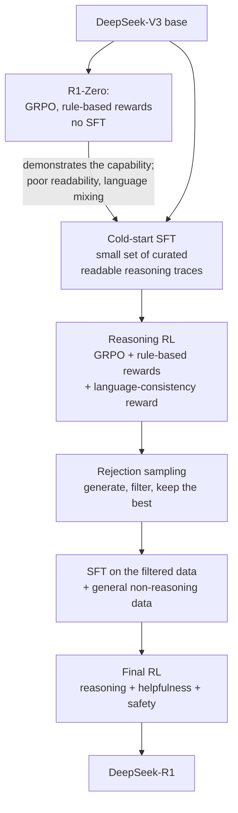

# Chapter 15: GRPO and the reasoning revolution

> Reading time: ~45 minutes. By the end of this chapter you should understand what GRPO is and how little it differs from RLOO, why the shift to verifiable rewards mattered far more than the algorithm did, what R1-Zero demonstrated about RL without any SFT at all, and which of the "emergent" reasoning behaviours are genuinely emergent versus artifacts of the objective. You should be able to run GRPO and recognize its three characteristic failure modes.

*Current as of early 2025.*

## 15.1 What actually changed

Between late 2024 and early 2025 the field acquired a capability it had been failing to get for two years: models that reason at length, check their own work, backtrack when they go wrong, and get dramatically better at math and code as a result.

The story that circulated was "GRPO unlocked reasoning." That is not quite right, and the correction matters for anyone trying to apply this.

GRPO [\[15\]](../appendix/b-references.md#15-grpo) is a modest algorithmic simplification of RLOO (§13.8), which is itself a modest simplification of PPO. If you have read Chapter 13, you already understand GRPO — it takes about a page to explain, and this chapter's §15.2 is that page.

What actually changed was **what you optimize against**. The reasoning models were trained with *verifiable* rewards: a program checks whether the answer is right. That single change removes reward hacking (§12.6), removes overoptimization as a binding constraint, removes the need for a reward model, and — critically — lets you optimize *hard*, for many more steps than RLHF against a learned reward model can survive.

GRPO is the algorithm that happened to be in the room. The verifiable reward is the thing that mattered. Chapter 12 §12.9 set this up; this chapter is what it produced.

## 15.2 The algorithm

For each prompt $q$, sample a **group** of $G$ responses from the current policy. Score each with the reward function. The advantage for response $i$ is its reward standardized within the group:

$$A_i = \frac{r_i - \mathrm{mean}(\mathbf{r})}{\mathrm{std}(\mathbf{r})}$$

That is the whole idea. **The baseline is the group mean.** No value network — the other responses to the same question tell you how good this one is.

The full objective keeps PPO's clipping and an explicit KL term:

$$\mathcal{J}_{\mathrm{GRPO}} = \mathbb{E}\left[ \frac{1}{G}\sum_{i=1}^{G} \frac{1}{|o_i|} \sum_{t=1}^{|o_i|} \min\Big( \rho_{i,t} A_i, \; \mathrm{clip}(\rho_{i,t}, 1-\epsilon, 1+\epsilon) A_i \Big) \;-\; \beta \, \mathbb{D}_{\mathrm{KL}}\big[\pi_\theta \,\|\, \pi_{\mathrm{ref}}\big] \right]$$

where $\rho_{i,t}$ is the usual probability ratio from §13.4. Note that $A_i$ carries no $t$ subscript: **every token in a response gets the same advantage.** There is no per-token credit assignment, which is exactly the argument RLOO made (§13.8) — the reward is a property of the whole response, so propagating it per-token was machinery in search of a problem.

```python
import torch
import torch.nn.functional as F


def grpo_advantages(rewards: torch.Tensor, normalize_std: bool = True) -> torch.Tensor:
    """Group-relative advantages.

    rewards: (num_prompts, G) -- G sampled responses per prompt.

    Every token in response i receives A_i. Compare to rloo_advantages in
    Chapter 13: RLOO excludes sample i from its own baseline (unbiased), GRPO
    uses the full group mean (slightly biased, simpler). In practice the
    difference is small; the std division is the more consequential choice.
    """
    mean = rewards.mean(dim=1, keepdim=True)
    adv = rewards - mean
    if normalize_std:
        # Dividing by the group std makes the update scale-free per prompt.
        # It also introduces a bias -- see section 15.9.
        adv = adv / (rewards.std(dim=1, keepdim=True) + 1e-4)
    return adv


def k3_kl(policy_logps: torch.Tensor, ref_logps: torch.Tensor) -> torch.Tensor:
    """Low-variance unbiased KL estimator, per token.

    The naive estimator (policy_logp - ref_logp) is unbiased but high-variance
    and can go negative. This one is always non-negative, which matters when it
    is a penalty term. GRPO uses it; it comes from Schulman's note on KL
    approximation.

        k3 = exp(ref - policy) - (ref - policy) - 1
    """
    diff = ref_logps - policy_logps
    return torch.exp(diff) - diff - 1.0
```

**Differences from RLOO**, all minor:

| | RLOO | GRPO |
|---|---|---|
| Baseline | Mean of the *other* $G-1$ samples | Mean of all $G$ samples |
| Bias | Unbiased | Slightly biased |
| Std normalization | No | Yes (usually) |
| Clipping | Optional | Yes (PPO-style) |
| KL term | Optional | Explicit, k3 estimator |

If you understood §13.8, you understand this. That is the honest framing, and it is worth stating because the amount of attention GRPO received suggests a bigger algorithmic leap than actually occurred.

## 15.3 The three models that remain

GRPO's practical appeal, against §13.5's arithmetic:

```
PPO:   policy (16 B/param) + value (16) + reference (2) + reward (2)
GRPO:  policy (16 B/param) +              reference (2) + verifier (free)
```

For a 70B policy:

```
PPO:   1,120 + 1,120 + 140 + 14  =  2,394 GB
GRPO:  1,120 +     0 + 140 +  0  =  1,260 GB
```

Nearly halved, and the deleted components are the two that caused the most trouble: the value network (which diverges, §13.7) and the learned reward model (which gets hacked, §12.6).

And if you drop the KL term entirely — which several R1-style recipes do — you delete the reference model too, leaving one model in memory. Whether that is wise is §15.7.

## 15.4 Verifiable rewards, and why they change the calculus

The reward function for R1's reasoning training [\[10\]](../appendix/b-references.md#10-deepseek-r1) is, in essence:

```python
def reasoning_reward(response: str, ground_truth: str) -> float:
    """Rule-based reward. No neural network anywhere in this function."""
    reward = 0.0

    # 1. Format: did it use the required reasoning structure?
    if has_think_tags(response):
        reward += FORMAT_BONUS

    # 2. Accuracy: is the final answer correct?
    answer = extract_final_answer(response)
    if answer is not None and answers_match(answer, ground_truth):
        reward += ACCURACY_BONUS

    return reward
```

That is it. A regex and a comparison.

Now revisit everything Chapters 12 and 13 worried about:

- **Reward hacking (§12.6)?** There is nothing to hack. The reward is not an approximation of human preference; it *is* the criterion. A model that games it has, by construction, produced a correct answer in the required format.
- **Overoptimization (§12.6)?** The gold-versus-proxy gap does not exist because there is no proxy. You can optimize for thousands of steps.
- **Reward-model staleness (§12.7)?** A verifier does not drift as the policy moves.
- **Length bias (§12.6)?** Not from the reward. (Length grows anyway, for a different reason — §15.6.)
- **The KL budget (§13.6)?** Much less critical. The KL term existed to stop you running past the overoptimization peak. Without a peak, you can afford to be far more permissive.

**This is the actual unlock.** RLHF against a learned reward model is a careful, budgeted procedure where you stop early because you know the signal degrades. RL against a verifier is an optimization you can just *run*, for as long as you have compute, and it keeps getting better.

The constraint, restated from §12.9: this only works where a verifier exists. Math with checkable answers, code with tests, structured output, formal logic, games. That is a narrow slice of what an assistant does — and it turned out to be the slice where the capability gains generalize furthest.

## 15.5 R1-Zero: no SFT at all

The result in the R1 paper that surprised the field.

Standard pipeline: base model → SFT → RL. Everyone assumed SFT was mandatory, because a base model does not produce well-formed responses and RL needs something coherent to improve on.

R1-Zero skipped it. Base model → GRPO with rule-based rewards → a strong reasoning model. No supervised fine-tuning, no demonstration data, no human-written reasoning traces.

It worked. AIME accuracy climbed substantially over training. The model developed extended chain-of-thought reasoning on its own, from a reward that only ever said *right* or *wrong* about the final answer.

What this demonstrates, precisely:

**Reasoning capability was already in the base model.** RL did not install it; RL found it. The base model, trained on trillions of tokens including a great deal of mathematical writing, already assigned non-trivial probability to correct reasoning traces. GRPO amplified that probability. This is the LIMA argument (§11.2) in a much stronger form: not just format, but a whole capability, already latent.

**The reward signal can be extraordinarily sparse.** One bit at the end of a two-thousand-token response, and it is enough. This runs against the intuition that RL needs dense reward, and it is why the process-reward-model literature (Chapter 16) is less dominant than expected.

**SFT is optional, not necessary.** For this capability, on a strong enough base model.

R1-Zero also had real problems, and the paper is direct about them: poor readability, and **language mixing** — the model would reason in a blend of English and Chinese mid-trace. Which makes sense. Nothing in the reward mentioned language. The model used whatever tokens made the reasoning work, and if a Chinese mathematical phrase was a more efficient representation, it used it.

That is a clean illustration of a principle that recurs: **RL optimizes exactly what you specify, and nothing else.** Every property you care about but did not encode is free to degrade.

The full R1 (as opposed to R1-Zero) reintroduced a small SFT stage — a "cold start" on a few thousand curated reasoning traces — specifically to fix readability and language consistency before the main RL run. Chapter 19 walks the full pipeline.

## 15.6 What emerges

The behaviours that appear during GRPO training on verifiable rewards, and what is actually going on in each.

**Response length grows, a lot.** Traces go from hundreds of tokens to thousands, and in R1's case to tens of thousands. Crucially, nothing in the reward mentions length.

Why it happens: longer reasoning produces correct answers more often. Extra steps mean more chances to catch an error, to try a second approach, to verify. The policy discovers this and length increases as a *consequence* of optimizing accuracy.

This is worth distinguishing sharply from the length bias in §12.6. There, length grew because the reward model spuriously preferred it. Here, length grows because length genuinely helps. Same symptom, opposite diagnosis — and a good test of whether you have understood both chapters.

**Self-verification and backtracking.** The model starts writing things like "wait, let me check that" and "that gives a contradiction, so let me reconsider." These were not demonstrated in any training data; they emerged from the objective.

Same mechanism: checking your work increases accuracy, so the policy learns to check its work.

**The "aha moment."** The R1 paper documents a training checkpoint where the model, mid-trace, stops and reconsiders its approach in a way that reads strikingly like insight. It is a memorable observation and it circulated widely.

The honest framing: this is a policy-gradient method increasing the probability of token sequences that preceded correct answers. That it looks like insight is genuinely interesting — it suggests these behaviours are latent in the base model and that a correctness signal is enough to surface them. It does not require any additional mechanism to explain.

**Test-time compute scaling.** Because the model learned to use more tokens when a problem is harder, it exhibits a compute-versus-accuracy trade-off at inference. Give it more token budget, get better answers. This is the property that makes reasoning models commercially distinctive, and it was not designed in — it fell out of optimizing accuracy with no length constraint.

## 15.7 What goes wrong

Three characteristic failure modes. All three are the same underlying issue: **the reward specifies less than you care about.**

**Length exploitation.** Length growth is beneficial up to a point and then stops being so. Past that point the model pads: restating the problem, enumerating irrelevant cases, verifying things it already verified. Accuracy plateaus while cost per query keeps climbing.

There is also a specific technical driver, identified by Liu et al. [\[70\]](../appendix/b-references.md#70-dr-grpo): the $1/|o_i|$ length normalization in the GRPO objective. Dividing by response length means each token in a long response receives a smaller gradient. For a *wrong* answer (negative advantage), that means longer wrong responses are penalized *less per token* — so the objective quietly rewards being wrong at length. Their fix ("Dr. GRPO") removes both this normalization and the std division from §15.9.

Practical mitigations: an explicit length penalty past a threshold; a cost-aware reward; or simply capping generation length and accepting the truncation.

**Language mixing and readability collapse.** R1-Zero's problem. The reward says nothing about language, formatting, or intelligibility, so all three are free to drift toward whatever is optimal for correctness. Fixes: a small SFT cold start (what R1 did), a language-consistency term in the reward, or a KL penalty against a reference model that speaks properly.

**Format collapse under a format bonus.** If you reward format compliance, the model will produce perfect format around empty reasoning. `<think>` tags containing "Let me think about this. The answer is 42." Format is far easier to optimize than correctness, so it saturates first, and if the format bonus is large relative to the accuracy bonus you get a model that has learned the theatre of reasoning. Keep the format bonus small — it is there to make parsing reliable, not to be a training target.

**And the failure mode you should expect but do not get:** reward hacking in the §12.6 sense. It does not occur, because there is no learned proxy. What you get instead are these specification failures — the reward is *correct* but *incomplete*. That distinction is the entire practical difference between Chapters 13 and 15.

## 15.8 The shape of the R1 pipeline

Chapter 19 is the full case study; the outline here is for context.



Two things to notice.

**Rejection sampling is still in there** (§11.10). Even in the most RL-forward pipeline published, a large fraction of the work is generate-filter-retrain. RL and rejection sampling are complements, not alternatives.

**The final stage mixes reward types.** Verifiable rewards for reasoning, learned rewards for helpfulness and safety. The hybrid from §12.9, in production.

## 15.9 Practical GRPO

**Group size $G$.** Typically 8 to 64. The trade-off is direct: larger $G$ gives a better baseline estimate and lower gradient variance, and costs proportionally more generation (§13.9 — generation dominates wall-clock, so $G$ multiplies your run time).

There is a subtler consideration. If a problem is so hard that all $G$ samples are wrong, every reward is identical, the group std is zero, and **every advantage is zero — the prompt contributes no gradient at all.** Same if all $G$ are right. So your effective batch size is only the prompts where the group *disagrees*, and $G$ needs to be large enough that hard problems sometimes produce a correct sample.

This has a direct consequence for curriculum: **prompts your model always gets right and prompts it always gets wrong are both worthless.** The useful prompts sit near 50% success. Filtering your training set by measured pass rate is one of the highest-leverage things you can do, and it is cheap.

**Batch structure.** Everything is organized by prompt. A batch is $N$ prompts × $G$ samples, advantages are computed within each group, and the group must be complete before any of it can be used.

**The std normalization debate.** Dividing by the group standard deviation (§15.2) makes updates scale-free per prompt — a prompt where rewards range over 0.1 and one where they range over 10 contribute comparably. That sounds good.

Liu et al. [\[70\]](../appendix/b-references.md#70-dr-grpo) point out it also introduces a bias: prompts with low reward variance get their advantages *amplified* by the small denominator. Low variance means the model is nearly certain — the easy and the impossible prompts — so the normalization systematically upweights exactly the prompts §15.9 just said are worthless.

Practical guidance: try it without the std division. It is a one-line change and on several published reproductions it helps.

**KL coefficient.** Much less critical than in RLHF, and some recipes set $\beta = 0$. Arguments for keeping a small one: it prevents readability collapse (§15.7), and it keeps the model from drifting so far that its general capabilities degrade. Arguments for dropping it: it costs a whole reference model in memory, and it constrains exactly the large-scale movement that produces the capability gain. Common practice is a small $\beta$ (0.001–0.01), or zero with an SFT cold start doing the anchoring instead.

**Learning rate.** 1e-6 to 5e-6, as in PPO.

**What to watch:**

| Metric | Healthy | Trouble |
|---|---|---|
| Accuracy on a held-out set | Rising | Plateau while length rises |
| Mean response length | Rising, then stabilizing | Rising without bound |
| Fraction of groups with zero variance | Low and falling | High — your prompts are mis-calibrated |
| Format-compliance rate | Rises fast to near 1 | At 1 while accuracy is flat: format collapse |
| Language consistency | Stable | Falling — §15.7 |
| Policy entropy | Gentle decline | Cliff — collapse, as in §13.7 |

## 15.10 Extending verifiable rewards

The obvious question: how far does this go beyond math and code?

**Working well now:**

- **Math** with checkable numeric or symbolic answers.
- **Code** with unit tests. Also compilation, type-checking, linting, and performance benchmarks — a rich, graded reward signal rather than a single bit.
- **Structured output** against a schema.
- **Constraint following** — "exactly three bullet points," "no word longer than ten letters." Programmatically checkable, and it turns out to transfer to general instruction-following.
- **Formal proofs** in Lean or Coq, where the proof checker is the reward. The cleanest verifier in existence.
- **Games and puzzles** with rules engines.

**Being actively worked on:**

- **Agentic tasks** where success is observable — did the file get created, did the test suite pass, did the transaction complete. Chapter 18.
- **Retrieval and citation** — is the cited source real, does it contain the claim. Partially verifiable.
- **Multi-step tool use**, where each tool call either succeeded or did not.

**Still no verifier:**

- Creative writing, tone, and taste.
- "Is this explanation clear?"
- Most safety judgements.
- Open-ended advice.

The strategic picture: labs are pushing hard on converting judgement problems into verification problems, because verification is the thing that scales. Every capability that moves from the third list to the first becomes something you can optimize without a human in the loop. That reframing — *what can I turn into a verifier?* — is the most useful thing to take from this chapter for your own work.

## 15.11 Open questions

Stated as open because they are, and because confident answers to them are currently ahead of the evidence.

**How far does reasoning transfer?** Training on math and code improves math and code. It appears to improve some general reasoning. Whether it improves anything genuinely far from the training domain is contested and the evaluations are not clean.

**Is the base model the ceiling?** R1-Zero showed RL surfacing latent capability. If RL only amplifies what the base model already assigns some probability to, then reasoning ability is bounded by pre-training and the RL is a very efficient extraction procedure. If RL can compose genuinely new capability, the ceiling is elsewhere. The evidence is not decisive.

**How much does the algorithm matter?** GRPO, RLOO, and plain REINFORCE with a group baseline perform comparably in several careful reproductions. If the algorithm is not the lever, the levers are the reward design, the prompt curriculum, and the base model — which is a much less satisfying but probably more accurate picture.

**Does process supervision beat outcome supervision?** Chapter 16's question. The theoretical argument for process rewards is strong; R1 got very far without them.

**What is the compute-optimal split** between pre-training, mid-training, and reasoning RL? Nobody has published a scaling law for this, and it is likely the most valuable unpublished number in the field.

## 15.12 JD, decoded

**RL / Reasoning Researcher.** Owns the reward design and the curriculum. Note what this job actually is: much less algorithm work than the job title suggests, and much more *problem set construction* — sourcing verifiable problems, calibrating their difficulty, building verifiers. A JD mentioning "verifiable rewards," "RLVR," or "reasoning post-training" is this role.

**RL Infrastructure Engineer.** Same as §13.12, more so. GRPO with $G = 32$ generates 32 responses per prompt, each potentially tens of thousands of tokens. The generation load is enormous and the sequences are long, which stresses KV cache management specifically. Chapter 22 is not optional here.

**Verifier / Evaluation Engineer.** A role that barely existed three years ago: building and maintaining the programs that score model outputs. Sandboxed code execution at scale, symbolic math comparison, schema validation, and — the hard part — making these robust to a model actively finding their edge cases. This is a real specialty now.

**Data Engineer (reasoning).** Sourcing and calibrating problems with known answers, at scale, without contaminating your evaluation sets (Chapter 23 §23.6). Harder than it sounds and it gates everything else.

## 15.13 What you should take from this chapter

1. **GRPO is RLOO with the group mean as the baseline.** The algorithmic content is small; if you understood §13.8 you understand it.
2. **The verifiable reward is what changed things**, not the algorithm. It removes reward hacking, removes overoptimization as a binding constraint, and lets you optimize for thousands of steps instead of stopping early.
3. **Every token in a response gets the same advantage.** No per-token credit assignment — the reward is a property of the whole response.
4. **GRPO drops the value network and the reward model**, roughly halving PPO's memory and deleting its two main instability sources.
5. **R1-Zero showed RL works with no SFT at all.** Reasoning was latent in the base model; a one-bit correctness signal at the end of a long trace was enough to surface it.
6. **Length growth here is a consequence of optimizing accuracy**, not a reward-model artifact. Same symptom as §12.6, opposite cause.
7. **Self-verification and backtracking emerge from the objective**, because checking your work raises accuracy. No mechanism beyond policy gradient is needed to explain it.
8. **RL optimizes exactly what you specify.** Language mixing, unreadability, and format-over-substance are all specification gaps, not algorithm failures.
9. **Groups where all $G$ samples agree contribute zero gradient.** Filter your prompt set by measured pass rate; prompts near 50% success are where the signal is.
10. **The strategic move is converting judgement into verification.** Every capability that gains a verifier becomes something you can optimize without a human in the loop.

The next chapter asks whether rewarding each *step* beats rewarding only the final answer — process reward models, verifiers, and the search-time compute that R1's length growth was an unsupervised discovery of.

---

**Exercises:** [Chapter 15 problem set](../../exercises/ch15.md) — includes the zero-variance-group calculation, reward design for a new domain, and diagnosing all three §15.7 failures.
**Lab:** [`lab15_grpo_countdown`](../../labs/lab15_grpo_countdown.py) — implement group-relative advantage, then test §15.6's claim from the other side: on a task where longer reasoning does *not* help, response length **collapses**, and adding an unbounded per-token bonus drives it to the maximum while accuracy falls to zero. Also measures the zero-advantage problem — by the end of training almost every group agrees with itself and produces no gradient at all.

---

**References for this chapter**

- [\[1\] DeepSeek-V3 Technical Report](../appendix/b-references.md#1-deepseek-v3) — DeepSeek-AI, December 2024. The base model R1 was built from.
- [\[10\] DeepSeek-R1](../appendix/b-references.md#10-deepseek-r1) — DeepSeek-AI, January 2025. R1-Zero, the rule-based rewards, the emergent behaviours, and the honest account of language mixing.
- [\[15\] GRPO / DeepSeekMath](../appendix/b-references.md#15-grpo) — Shao et al., April 2024. The algorithm.
- [\[53\] Tülu 3](../appendix/b-references.md#53-tulu-3) — Lambert et al., November 2024. RLVR with open code.
- [\[62\] RLOO](../appendix/b-references.md#62-rloo) — Ahmadian et al., February 2024. The immediate predecessor.
- [\[69\] Kimi k1.5](../appendix/b-references.md#69-kimi-k15) — Kimi Team, January 2025. A contemporaneous, independently-developed reasoning-RL recipe; useful as a second data point on what is essential.
- [\[70\] Understanding R1-Zero-Like Training](../appendix/b-references.md#70-dr-grpo) — Liu et al., March 2025. Identifies the length and std-normalization biases in the GRPO objective.
- [See full reference list](../appendix/b-references.md)
