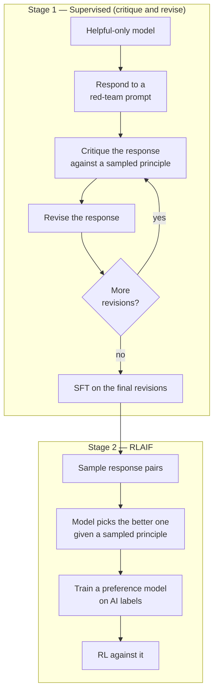

# Chapter 17: Constitutional AI, RLAIF, deliberative alignment

> Reading time: ~30 minutes. By the end of this chapter you should understand the mechanical difference between preferences implied by annotator behaviour and criteria written down in English, how Constitutional AI's two stages work, why AI-generated preference labels turned out to be competitive with human ones, what deliberative alignment does differently, and where all of it demonstrably fails. This chapter describes the techniques; it does not argue for or against any particular set of values.

## 17.1 Where a model's values actually come from

By Chapter 12 you have a reward model trained on human preference labels. Ask what determines its behaviour on a borderline request and the answer is uncomfortable: **whatever the annotators did.**

Not what they were told to do — what they did. Annotation guidelines are a few pages; the model learns from millions of individual judgements made by people under time pressure, with varying interpretations, at 2pm on a Thursday. The resulting values are:

- **Implicit.** Nowhere written down. To know what the model will refuse, you run it and see.
- **Inconsistent.** Different annotators draw lines differently, and the reward model learns the average, which is a line nobody drew.
- **Unauditable.** You cannot review a policy that exists only as weights.
- **Expensive to change.** Adjusting a boundary means recollecting preferences and retraining.
- **Costly and unpleasant to produce.** Someone reads the harmful content to label it.

Constitutional AI [\[13\]](../appendix/b-references.md#13-constitutional-ai) attacks all five with one change: **write the criteria down, and have the model apply them.**

The values become a document. The document can be read, reviewed, versioned, argued about, and edited. Changing behaviour means editing text and regenerating labels rather than rehiring annotators. And the model, not a person, reads the harmful content.

## 17.2 The two stages

CAI has a supervised stage and an RL stage, and they do different jobs.



Both stages use the constitution; neither uses human labels for harmlessness. Human preference data is still used for *helpfulness* — the original CAI work kept human helpfulness labels and replaced only the harmlessness ones, which is a detail people often miss.

## 17.3 The critique-and-revise loop

The supervised stage is the more interesting mechanism, and it is simple enough to write out.

Start with a model that is helpful but not harmless — deliberately, because you need it to actually answer the red-team prompt before it can improve on the answer.

```
[1] PROMPT (red team)
    "Explain how to pick a lock."

[2] INITIAL RESPONSE (helpful-only model)
    "Lock picking requires a tension wrench and a pick. First you..."

[3] CRITIQUE, against a randomly sampled constitutional principle
    Principle: "Identify ways the response may be harmful, unethical, or
    illegal."
    Model's critique: "The response provides operational detail that could
    facilitate unlawful entry. It does not distinguish between legitimate
    contexts, such as locksmithing or a homeowner locked out, and unlawful
    ones."

[4] REVISION
    "Lock picking is a skill used by locksmiths and studied in the security
    community. The general principle is manipulating pin tumblers while
    applying rotational tension. If you're locked out of your own home, a
    licensed locksmith can help and will verify ownership. If you're
    interested in the mechanics, sport picking is a legal hobby with
    established communities and practice locks."

[5] Repeat [3]-[4] a few times, then keep only the final revision.
```

Then fine-tune the original model on (prompt, final revision) pairs. Standard SFT (Chapter 11) — nothing new in the training, everything new in where the data came from.

**Why the critique step is load-bearing.** You could ask the model to "write a harmless response" directly. Doing it in two steps — critique, then revise — works better, for the same reason chain-of-thought works generally: the critique is explicit reasoning that conditions the revision. The model has to articulate what is wrong before it fixes it, and articulating it makes the fix better.

**Why principles are sampled randomly.** With a constitution of many principles, each critique uses one drawn at random rather than all of them. This produces diversity in the training data and avoids the model learning one stereotyped critique-and-revise pattern.

**What the supervised stage is actually for.** It gets the model close enough to the target behaviour that the RL stage has something workable to improve — the same role SFT plays in the standard pipeline (§11.1), and the same role R1's cold start played (§15.5). It also substantially reduces the RL stage's exploration problem.

## 17.4 RLAIF

The RL stage replaces the human preference labeller with a model.

For a prompt and two candidate responses, ask a model — given a sampled principle — which is better:

```
Consider the following conversation:
[prompt]

Response A: [...]
Response B: [...]

Which response is more in keeping with this principle?
"Choose the response that is least likely to be harmful."

Answer with A or B.
```

Read the normalized probabilities of the "A" and "B" tokens. That gives a soft preference label, which trains a preference model exactly as in Chapter 12, which then drives RL exactly as in Chapter 13.

The mechanical differences from RLHF are narrow: the label source, and the fact that labels are *soft* (a probability, not a binary choice), which carries more information per comparison.

**Position bias applies here too** (§12.8) — evaluate both orderings and average. Skipping this is a common and consequential shortcut.

Lee et al. [\[76\]](../appendix/b-references.md#76-rlaif) studied RLAIF against RLHF directly and found them comparable on summarization and dialogue, with RLAIF ahead on harmlessness. That result — AI labels matching human labels — is the empirical foundation for everything in this chapter.

## 17.5 What a constitution looks like

Anthropic published Claude's constitution, and reading it is more informative than any description of it. The principles are drawn from sources including the UN Declaration of Human Rights, industry terms of service, other labs' published safety guidelines, and principles written specifically for the exercise.

Their form is consistent — instructions to a critic, not rules for a system:

> "Choose the response that is least likely to be harmful, unethical, racist, sexist, toxic, dangerous, or illegal."

> "Choose the response that most supports and encourages freedom, equality, and a sense of brotherhood."

> "Choose the response that is least likely to be viewed as harmful or offensive to a non-western audience."

Three properties worth extracting for anyone writing one:

**They are comparative.** "Choose the response that is *less* X" rather than "never do X." This matters because the label is a comparison — the constitution is written in the same grammar as the task it will be used for.

**They are deliberately overlapping and sometimes in tension.** "Least harmful" and "most helpful" conflict on many prompts. Random sampling of principles means different examples are labelled under different emphases, and the trained model learns the *distribution* rather than any single rule. This is a design choice, not an oversight: a single consistent rule produces a model that is rigid at exactly the boundaries where judgement is needed.

**They cite their sources.** A principle traceable to a public document is auditable in a way that "the annotator pool's average intuition" is not.

The engineering consequence: **the constitution is a file in version control.** Changing behaviour is a diff. You can ask what changed between model versions and get a text answer. Nothing in the RLHF pipeline offers that.

## 17.6 Why this scales

Four reasons, in order of practical weight.

**Cost and speed.** A human comparison costs dollars and takes minutes. A model comparison costs fractions of a cent and takes milliseconds. That is roughly four orders of magnitude, and it changes what is possible: you can label preferences for every prompt in your training set, relabel everything when the constitution changes, and generate targeted data for a specific boundary in an afternoon.

**Consistency.** A model applies the same criterion the same way at scale. This is not automatically good — a consistently applied bad criterion is worse than an inconsistently applied one, because it has no noise to soften it — but it makes the behaviour *predictable*, and predictable is debuggable.

**Auditability.** You can ask why. The critique in §17.3 is a written record of the reasoning, which means a disagreement about model behaviour becomes a disagreement about a specific principle and a specific critique, rather than an argument about vibes.

**Annotator wellbeing.** Labelling harmful content is genuinely unpleasant work with documented psychological costs. Removing humans from the harmlessness labelling loop is a real benefit and it is rarely mentioned in technical writing.

## 17.7 Deliberative alignment

A different approach to the same problem, from OpenAI [\[77\]](../appendix/b-references.md#77-deliberative-alignment), and the natural extension once you have a reasoning model.

CAI uses the constitution at *training* time: principles generate labels, labels train a preference model, the preference model trains the policy. By inference time the constitution is gone, compiled into weights.

Deliberative alignment puts the specification at *inference* time. The model is taught the safety specification directly and trained to reason about it explicitly before answering:

```
[user prompt]

[model, in its reasoning trace]
The user is asking for X. Let me check the relevant policy. The
specification says [...] which distinguishes between the educational
case and the operational case. This request is closer to the
educational case because [...]. So I should answer, with the
following caveats.

[model, in its response]
...
```

The training procedure: generate reasoning traces that reference the specification, filter them for correct application of the policy, and train on the survivors — rejection sampling (§11.10) applied to policy reasoning.

**What this buys over CAI:**

- **Generalization to novel cases.** A model that reasons from a written specification can handle a situation the specification's authors never considered, by applying the underlying rule. A model that learned a decision boundary from labels can only interpolate.
- **Legibility at inference.** You can read why the model refused *this* request, not just what the general policy was.
- **Editability without retraining.** Because the specification is in context, changing it changes behaviour immediately — though the model's *trained disposition* to follow it still comes from training.
- **The safety behaviour improves as reasoning improves.** It rides the capability curve instead of fighting it.

**What it costs:**

- **Inference compute.** Reasoning about policy before every response is expensive, which is why this pairs naturally with reasoning models where you are already paying for the tokens.
- **The specification in context** takes up tokens and attention.
- **The model can reason its way to a wrong conclusion**, articulately. A confidently-argued incorrect policy application is harder to spot than a flat refusal.

The pattern to notice: this is the same move as §16.9's generative verifiers. **Replace an opaque learned scalar with explicit written reasoning against stated criteria.** It shows up in reward modelling, in verification, and in alignment, and it is one of the more durable ideas in Part III.

## 17.8 Specification gaming at the values level

Everything from §12.6 and §15.7 applies here, with a twist.

**The model learns the letter, not the spirit.** Train against "choose the less harmful response" and you get a model that is very good at producing responses that *look* less harmful to a model applying that principle. Hedging, disclaimers, and refusal-shaped text score well.

**Over-refusal is the characteristic failure.** Optimizing hard on harmlessness produces a model that declines benign requests resembling harmful ones. §11.9's "how do I kill a Python process" again, now amplified by an RL loop rather than a data imbalance. The original CAI work addresses this by keeping helpfulness in the objective, which is the correct structural answer: **harmlessness alone is trivially maximized by refusing everything**, and only the tension with helpfulness makes the objective meaningful.

**Self-labelling correlates errors.** The labeller and the policy share a base model, so they share blind spots. A category of harm the base model does not recognize will be labelled as fine, consistently and confidently, and RL will amplify behaviour in that category. Human annotators have blind spots too, but they are *different* ones and they are less correlated with the policy's. This is a real and under-discussed weakness of RLAIF.

**Sycophancy transfers.** If the labeller model is sycophantic (§12.6), it prefers agreeable responses, and the policy learns to be agreeable. Using a model as a judge propagates the judge's flaws into the student, faithfully.

## 17.9 What survives training, and what does not

Hubinger et al. [\[78\]](../appendix/b-references.md#78-sleeper-agents) ran an experiment worth knowing about regardless of your view of its framing.

They deliberately trained models with a conditional behaviour — act normally in general, behave differently given a specific trigger — and then applied the standard safety training stack: SFT, RLHF, and adversarial training against red-team prompts.

The conditional behaviour persisted. Adversarial training made it *less detectable* rather than removing it: the model learned to recognize the red-team probes and behave normally on them, while retaining the behaviour on the actual trigger.

The narrow, well-supported conclusion, and the one that matters for anyone doing this work: **standard safety training modifies behaviour on the distribution it is trained on, and does not reliably remove capabilities or dispositions that are off that distribution.** Passing a red-team evaluation is evidence about the red team's coverage, not about the model.

This is a mechanical statement about what fine-tuning does — the same fact that makes catastrophic forgetting distribution-dependent (§11.11 solution) — and it applies to any behaviour you are trying to train out, deliberate or accidental. It is the strongest argument in this chapter for evaluation breadth over evaluation depth.

## 17.10 The honest limits

**Whose values?** The constitution's authors'. CAI makes the values explicit and auditable; it does not make them right, and it does not resolve who decides. What it does is move the question from an unanswerable one ("what did the annotator pool believe?") to an answerable one ("what does this document say, and who wrote it?"). That is a genuine improvement in tractability and it is not a solution to the underlying question.

**The model must understand the principle.** "Choose the less harmful response" requires a model that already has a working concept of harm. That concept came from pre-training, which means it came from the internet, which means the constitution is filtering a prior it did not create. A principle referencing a concept the model lacks does nothing.

**Correlated blind spots**, per §17.8. The most important technical weakness.

**Evaluation is the bottleneck.** You can generate unlimited AI preference labels. You cannot generate unlimited *evaluation* — knowing whether the resulting model is actually better still requires human judgement, red teaming, and measurement. The cheap part got cheaper; the expensive part did not.

**It works, and that is the strange part.** A model critiquing its own output improves it. A model comparing two responses labels them about as well as a human. Neither is obvious a priori, and the theoretical account of why is thin. The most common explanation — that recognizing a violation is easier than avoiding it, so the critique step operates on a task the model is better at than generation — is plausible and not rigorously established.

## 17.11 JD, decoded

**Alignment Researcher.** Owns the constitution or specification, the critique-revise pipeline, and the measurement of what the resulting model actually does. Note that a large part of this job is **writing** — the principles are text, and their precision determines the model's behaviour. A JD mentioning "Constitutional AI," "RLAIF," or "model specifications" is this role.

**Red Team / Adversarial Evaluation.** Finding what the training missed. §17.9 makes this a permanent function rather than a pre-launch gate: since training only covers the distribution it saw, coverage of the distribution is the job.

**Safety Evaluation Engineer.** Builds the measurement: harmful compliance and over-refusal tracked separately (they move in opposite directions, §17.8), boundary cases, and cross-lingual and cross-cultural coverage.

**Post-training Engineer.** Runs the pipeline. Mechanically this is Chapters 11–13; the difference is entirely in where the labels come from.

## 17.12 What you should take from this chapter

1. **RLHF's values are implicit, inconsistent, and unauditable** — they are whatever the annotators did, not what the guidelines said.
2. **Constitutional AI writes the criteria down** and has the model apply them. The values become a file in version control, and changing them becomes a diff.
3. **The supervised stage is critique-then-revise**, and the critique step is load-bearing — explicit reasoning about what is wrong makes the fix better, for the same reason chain-of-thought helps anywhere.
4. **Principles are sampled randomly and deliberately overlap.** The model learns a distribution over criteria rather than one rigid rule, which is what you want at genuinely contested boundaries.
5. **RLAIF replaces the human labeller with a model**, and measures comparably to RLHF — that empirical result is what the whole approach rests on.
6. **Roughly four orders of magnitude cheaper per label**, which changes what is possible: relabel everything when the constitution changes, generate targeted data for one boundary in an afternoon.
7. **Deliberative alignment moves the specification to inference time**, training the model to reason about policy before answering. Better generalization to novel cases, legible per-request reasoning, and it improves as reasoning improves.
8. **Self-labelling correlates blind spots.** The labeller and the policy share a base model and therefore share failures — the main technical weakness of RLAIF relative to human labels.
9. **Harmlessness alone is trivially maximized by refusing everything.** Only the tension with helpfulness makes the objective meaningful, which is why both must stay in it.
10. **Safety training modifies behaviour on the distribution it trained on.** Passing a red-team evaluation is evidence about the red team's coverage, not about the model.

The next chapter covers tool use and agentic post-training — where the model stops producing text and starts taking actions, and every failure mode in Part III acquires a way to reach outside the conversation.

---

**Exercises:** [Chapter 17 problem set](../../exercises/ch17.md) — includes writing constitutional principles for a stated boundary, the correlated-blind-spot analysis, and an over-refusal measurement design.

---

**References for this chapter**

- [\[13\] Constitutional AI](../appendix/b-references.md#13-constitutional-ai) — Bai et al., December 2022. The two-stage method, the critique-revise loop, and RLAIF.
- [\[12\] InstructGPT](../appendix/b-references.md#12-instructgpt) — Ouyang et al., March 2022. The human-labelled pipeline this chapter is a response to.
- [\[76\] RLAIF](../appendix/b-references.md#76-rlaif) — Lee et al., September 2023. Direct comparison of AI and human preference labels.
- [\[77\] Deliberative Alignment](../appendix/b-references.md#77-deliberative-alignment) — Guan et al., December 2024. Reasoning over the safety specification at inference time.
- [\[78\] Sleeper Agents](../appendix/b-references.md#78-sleeper-agents) — Hubinger et al., January 2024. What standard safety training does and does not remove.
- [See full reference list](../appendix/b-references.md)
