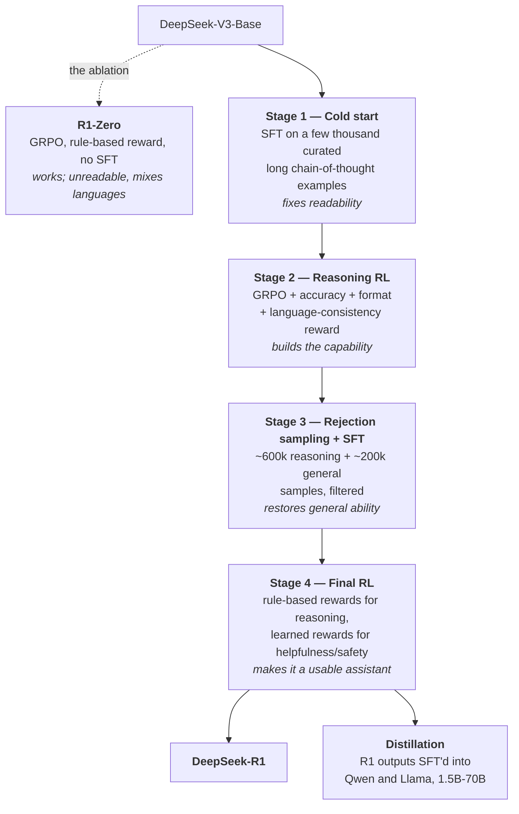

# Chapter 19: Case study — DeepSeek-R1 end-to-end

> Reading time: ~40 minutes. By the end of this chapter you should be able to reconstruct the full R1 pipeline from memory, explain what each of its four stages was for, name the two things the team tried and abandoned, and identify the half-dozen details the report deliberately does not give you. This is the chapter where Chapters 11 through 18 assemble into one artifact.

## 19.1 Why this is the case study

Chapter 10 used DeepSeek-V3 as the pre-training case study for one reason: the team published more honest detail than anyone else. R1 [\[10\]](../appendix/b-references.md#10-deepseek-r1) is the post-training equivalent, and it is arguably the more valuable document.

Three reasons it earns the chapter:

**It has an ablation nobody else published.** R1-Zero is the same recipe with the SFT stage removed. Very few papers show you the pipeline *and* the pipeline minus a component, on a frontier-scale model.

**It documents failures.** There is a section on unsuccessful attempts naming process reward models and MCTS. Negative results at this scale are rare and disproportionately informative — they tell you which paths a well-resourced team walked down and turned back from.

**The weights and the distilled models were released.** You can run it. Reproductions exist and largely confirm the account, which is not something you can say about most frontier claims.

The caveat that applies to every case study in this book: R1 is one lab's recipe, published at one moment, and some of its choices are contingent rather than optimal. Read it as an existence proof of a working pipeline, not as the pipeline.

## 19.2 The starting point

R1 begins where Chapter 10 ended: **DeepSeek-V3-Base**, the 671B-parameter MoE with 37B active parameters per token, trained on 14.8T tokens [\[1\]](../appendix/b-references.md#1-deepseek-v3).

Two properties of the base model matter for everything that follows.

**It is very strong, and it is a base model.** Not instruction-tuned. It continues text; it does not answer questions. Everything R1 becomes is built on top of what pre-training already installed — which is the point §15.5 turns on.

**It is a large MoE.** The post-training compute cost per token is set by the 37B active parameters, not the 671B total. But the *memory* is set by the total, and RL needs the policy plus a reference model plus a generation cluster (§13.10). The architecture that made pre-training affordable makes post-training infrastructure harder, and this trade-off is under-discussed.

## 19.3 R1-Zero

The experiment, run first and reported first.

**Recipe:** DeepSeek-V3-Base → GRPO with rule-based rewards. No SFT. No demonstration data. No human-written reasoning traces.

**The reward**, in full:

- **Accuracy.** For math, does the final answer match the key? For code with tests, do the tests pass? A program, not a model.
- **Format.** Did the response put its reasoning inside the required tags?

That is the entire reward function. §15.4 has the code; it is a regex and a comparison.

**The prompt template** was deliberately minimal — it asked for reasoning inside `<think>` tags and the answer inside `<answer>` tags, and specified nothing about *how* to reason. The report is explicit that this was to avoid biasing the model toward any particular strategy, so that whatever emerged, emerged.

**The result.** The reported AIME 2024 pass@1 rose from 15.6% to 71.0% over training, and reached 86.7% with majority voting at 64 samples — which is roughly the level of the leading closed reasoning model at the time.

From a base model, with a reward that only ever said *right* or *wrong*.

## 19.4 What R1-Zero established, and what it broke

**Established — reasoning was latent.** RL did not teach reasoning; it amplified reasoning the base model already assigned non-trivial probability to. This is §11.2's superficial alignment hypothesis in a much stronger form: not just response format, but an entire capability, already present and merely unlikely.

**Established — SFT is not required.** Everyone assumed a cold start was mandatory because RL needs something coherent to improve on. It is not, given a strong enough base model.

**Established — extreme reward sparsity works.** One bit at the end of thousands of tokens. This is the result that most changed how people think about reward design, and §16.7 and §18.7 are both downstream of it.

**Established — the behaviours emerge.** Response length grew steadily with no length term in the reward. Self-verification appeared ("wait, let me check"). Backtracking appeared. The report documents a checkpoint where the model stops mid-derivation and reconsiders its approach — the "aha moment" that circulated widely.

The mechanism is §15.6's and it needs nothing exotic: longer reasoning and self-checking both raise accuracy, so policy gradient raises their probability. That this looks like insight is genuinely interesting; it does not require an additional explanation.

**Broke — readability.** The traces were hard to read. Nothing rewarded clarity.

**Broke — language consistency.** The model reasoned in a mixture of English and Chinese within a single trace. Nothing in the reward mentioned language, so the model used whatever tokens were most efficient for the reasoning.

Both failures are the same failure, and it is the most portable lesson in this chapter: **RL optimizes exactly what you specify, and every property you care about but did not encode is free to degrade.** R1-Zero is the cleanest demonstration of that principle at scale that anyone has published.

## 19.5 The full pipeline

R1 proper is four stages, each fixing something the previous one could not.

### Stage 1 — cold start

A small SFT run on a few thousand curated long chain-of-thought examples, collected via few-shot prompting, by prompting a model to produce detailed answers with reflection, by taking readable R1-Zero outputs, and by human post-processing.

The purpose is narrow and worth stating precisely: **it is not to teach reasoning.** R1-Zero proved reasoning does not need SFT. The cold start fixes *presentation* — readability, language consistency, and a stable output format — so that the RL stage starts from something legible and stays legible.

The report also notes it improves the RL stage's convergence, which makes sense: starting from a policy already near the target region reduces the exploration burden.

This is the same structural role SFT plays in §11.1 and that CAI's supervised stage plays in §17.3. A pattern across all three: **the supervised stage exists to get RL into a workable starting region, not to install the capability.**

### Stage 2 — reasoning-oriented RL

GRPO again, on reasoning-heavy data, with the same accuracy and format rewards — plus a **language-consistency reward**, computed as the proportion of the trace in the target language.

The report is candid that this slightly *degrades* measured accuracy. The model reasons marginally better when allowed to mix languages. They kept it anyway because a model whose reasoning users cannot read is worse in a way accuracy does not capture.

That is a clean, explicit example of the §11.9 capability tax, decided deliberately and reported honestly. Most papers would not mention it.

### Stage 3 — rejection sampling and a second SFT

The stage that turns a reasoning specialist into a general model, and the one people skip when summarizing the pipeline.

Take the Stage 2 checkpoint. Generate many responses per prompt. Filter. Keep the best. Train on them. This is §11.10's rejection sampling, and the report describes assembling roughly **600,000 reasoning samples** this way, plus about **200,000 non-reasoning samples** covering writing, factual QA, self-cognition, and translation — reusing parts of the DeepSeek-V3 SFT pipeline — for about **800,000 total**, trained for two epochs.

Two things worth extracting.

**The filtering is broader than rule-based checking.** For reasoning data where a rule-based verifier applies, it is used. For the rest, the report describes using a generative judge — feeding the ground truth and the prediction to DeepSeek-V3 — and filtering out traces with mixed languages, long paragraphs, and code blocks. This is a learned scorer used as a *ranker* on a fixed candidate set, which is exactly the safe use §16.7 identifies.

**Non-reasoning data is there to prevent forgetting.** Stage 2 optimized hard on math and code. Without Stage 3's general data, the model would be excellent at competition math and noticeably worse at everything else — §11.9's capacity allocation, appearing as a consequence of RL rather than of a mixture decision.

### Stage 4 — final RL for all scenarios

A second RL stage, now with a hybrid reward (§12.9):

- **Rule-based rewards** for reasoning tasks, where verification is available.
- **Learned reward models** for helpfulness and harmlessness, following the DeepSeek-V3 preference pipeline.

The report describes evaluating helpfulness on the final summary only, and harmlessness across the entire response including the reasoning trace. That distinction is a real design decision: a model can reason its way through harmful content and produce a clean summary, and scoring only the summary would miss it.

This stage is where R1 becomes usable. Stages 1–3 produce something that reasons well; Stage 4 produces something you can ship.

## 19.6 Distillation

A separate result, and the one with the broadest practical impact.

Take the ~800k samples from Stage 3 and SFT them into smaller open models — Qwen2.5 and Llama, from 1.5B to 70B. No RL on the small models at all; pure supervised fine-tuning on R1's outputs.

The distilled models substantially outperformed their bases on reasoning benchmarks. The reported 32B and 70B distillations reached levels competitive with much larger reasoning models.

The comparison that makes this interesting: the report also applied large-scale RL *directly* to a small model and found that **distillation from the large model beat RL on the small one**, at less compute.

The implication, stated carefully because it is easy to over-read: **for reasoning, at these scales, distilling from a strong reasoner appears more effective than running RL on a weak one.** The large model's exploration — the expensive part — transfers through its outputs. This is consistent with §19.4's finding that RL surfaces latent capability: if the small model's base does not contain the capability, RL has nothing to surface, while SFT on a stronger model's traces can install a fair amount of it.

It also explains a great deal about the open-model ecosystem after January 2025. Every small reasoning model released in the following months used some version of this.

## 19.7 The unsuccessful attempts

The section that makes this report unusually valuable.

**Process reward models.** Tried, abandoned. The stated reasons: defining a fine-grained step in general reasoning is hard; determining whether an intermediate step is correct is hard, with automatic annotation unsatisfactory and human annotation unscalable; and — decisively — introducing a *learned* reward model makes reward hacking possible again, requiring retraining and complicating the pipeline. §16.7 covers this in full.

**Monte Carlo Tree Search.** Tried, abandoned. Token generation has an enormous branching factor compared to games where MCTS succeeded, and constraining it led to local optima. Training a fine-grained value model to guide the search was itself difficult.

What to take from these: **the team that made reasoning work at scale evaluated the two most theoretically-motivated enhancements and found them not worth it.** That is not proof they cannot work — the report says as much. It is strong evidence that the simple thing was sufficient, and that the burden of proof sits with the complicated thing.

## 19.8 What the report does not tell you

The §11.7-style reading-for-absence exercise, applied to this document. If you tried to reproduce R1 exactly, here is where you would stop.

**The RL data.** The prompt set for Stages 2 and 4 — how many problems, from where, at what difficulty distribution. Given §15.9 (groups where all samples agree contribute zero gradient), the difficulty calibration of the prompt set is one of the most load-bearing choices in the whole pipeline, and it is unpublished.

**The cold-start data.** "A few thousand" examples, with the collection approaches described but not the data, the selection criteria, or the exact count.

**GRPO hyperparameters.** Group size, KL coefficient, learning rate, clip range, batch composition, number of RL steps.

**The reward weights.** Accuracy versus format versus language consistency. §15.7 shows the format bonus being too large produces format collapse, so these ratios matter.

**The compute.** How many GPU-hours each stage cost. This is the number most people want and it is nowhere.

**The failures within the successful path.** How many runs diverged, what the intermediate checkpoints looked like, how the recipe evolved. Every paper omits this; it is still the biggest gap between reading a report and doing the work.

**The Stage 4 reward models.** Described by reference to the V3 pipeline, which itself does not fully describe them.

None of these omissions are unusual — this report is more forthcoming than most. Cataloguing them is the skill: the pattern of what a lab withholds tells you what it considers its moat, and here the answer is clearly **the data, not the algorithm.**

## 19.9 What reproductions found

Several open efforts reproduced R1-Zero-style training on smaller models within weeks of the release, and the convergent findings are worth more than any single one.

**The core result replicates.** GRPO with rule-based rewards on a strong base model produces growing response length, emergent self-verification, and large gains on verifiable tasks. This is robust across model families and scales.

**The base model matters enormously.** The same recipe on a weaker base produces much less. Consistent with §19.4 — RL surfaces what is there.

**The prompt difficulty distribution matters more than the algorithm.** Reproductions that filtered prompts by measured pass rate did substantially better. §15.9's zero-variance-group argument, confirmed empirically.

**Some of GRPO's details are not load-bearing.** Liu et al. [\[70\]](../appendix/b-references.md#70-dr-grpo) found the length normalization and the standard-deviation division both introduce biases, and removing them helps. Others found plain REINFORCE with a group baseline performs comparably. This supports §15.11's uncomfortable suggestion that the algorithm is not the lever.

**Kimi k1.5** [\[69\]](../appendix/b-references.md#69-kimi-k15), developed independently and published within days, arrived at a broadly similar place — long-context RL with verifiable rewards. Two teams converging independently is stronger evidence than either result alone.

## 19.10 The pipeline as a summary of Part III

R1 is a useful spine because nearly every chapter in this part appears in it:

| Stage | Chapter |
|---|---|
| Cold-start SFT | 11 — SFT, loss masking, mixture |
| Stage 3 filtering with a generative judge | 12 — reward models used as rankers |
| GRPO | 13, 15 — policy gradient, group baselines |
| Rule-based rewards | 12 §12.9, 15 §15.4 — verifiable rewards |
| Rejection sampling, Stage 3 | 11 §11.10 |
| PRM and MCTS, abandoned | 16 — process supervision |
| Stage 4 helpfulness and harmlessness | 12, 17 — learned rewards, safety |
| Distillation | 11 — a specialist generating data for a generalist |

And the two techniques the pipeline leans on hardest are the two simplest ones: **rejection sampling** and **a rule-based reward.** Neither requires a value network, a preference model, or a process reward model. That is the summary of Part III, and it would have been a surprising claim in 2023.

## 19.11 JD, decoded

A frontier post-training team building something like this needs, roughly in order of headcount:

**Data / problem-set engineers.** Sourcing verifiable problems at scale, calibrating difficulty, building verifiers, preventing evaluation contamination. Per §19.8, this is the moat.

**RL researchers.** Reward design, curriculum, ablations. Less algorithm work than the title implies.

**RL infrastructure engineers.** The §13.10 architecture at MoE scale: generation cluster, weight sync, rollout buffers, long-sequence KV cache management.

**Evaluation engineers.** Independent measurement, contamination detection, and reporting accuracy as a function of inference compute (§16.11).

**Safety / alignment engineers.** Stage 4's learned rewards, and the harmlessness evaluation over the full trace rather than the summary.

If you are reading this to target a role: the data and infrastructure roles are the ones with the most open headcount and the least competition, and R1's own report is the argument for why.

## 19.12 What you should take from this chapter

1. **R1-Zero is the ablation:** V3-Base plus GRPO plus a rule-based reward, no SFT, and it worked. Reasoning was latent in the base model; RL surfaced it.
2. **The reward was two rules** — is the answer right, is the format right. AIME pass@1 went from a reported 15.6% to 71.0% on that signal alone.
3. **R1-Zero broke readability and language consistency**, because nothing rewarded either. RL optimizes exactly what you specify and nothing else.
4. **The cold start fixes presentation, not capability.** Across Chapters 11, 17, and 19, the supervised stage's job is to put RL in a workable starting region.
5. **The language-consistency reward cost measured accuracy**, and they kept it. An explicitly-decided, honestly-reported capability tax.
6. **Stage 3 is rejection sampling** — roughly 600k reasoning plus 200k general samples — and it is what turns a reasoning specialist back into a general model.
7. **Stage 4 is a hybrid reward:** rules for reasoning, learned models for helpfulness and safety. Helpfulness scored on the summary, harmlessness on the whole trace.
8. **Distillation beat RL on small models.** SFT on a strong reasoner's traces transferred more capability than running RL on a weak base, for less compute.
9. **PRMs and MCTS were tried and abandoned**, for reasons that generalize: ill-defined steps, noisy labels, and a learned reward model reintroducing hackability.
10. **What the report withholds is the data**, not the algorithm — prompt sets, difficulty distributions, cold-start examples, reward weights. That pattern is the answer to where the moat is.

This closes Part III. The next part is the infrastructure that makes all of it possible: custom kernels, checkpointing, serving, and evaluation — starting with the layer where a 20% speedup is worth a month of one engineer's time.

---

**Exercises:** [Chapter 19 problem set](../../exercises/ch19.md) — includes reconstructing the pipeline from memory, a reading-for-absence exercise on the real report, and a distillation-versus-RL budget calculation.

---

**References for this chapter**

- [\[1\] DeepSeek-V3 Technical Report](../appendix/b-references.md#1-deepseek-v3) — DeepSeek-AI, December 2024. The base model, and the V3 SFT and preference pipelines Stages 3 and 4 reuse.
- [\[10\] DeepSeek-R1](../appendix/b-references.md#10-deepseek-r1) — DeepSeek-AI, January 2025. The primary source for this entire chapter. Read it directly; it is unusually readable.
- [\[15\] GRPO / DeepSeekMath](../appendix/b-references.md#15-grpo) — Shao et al., April 2024. The algorithm used in Stages 2 and 4.
- [\[26\] Let's Verify Step by Step](../appendix/b-references.md#26-process-reward-models) — Lightman et al., 2023. The PRM approach R1 evaluated and rejected.
- [\[69\] Kimi k1.5](../appendix/b-references.md#69-kimi-k15) — Kimi Team, January 2025. Independent, contemporaneous convergence on a similar recipe.
- [\[70\] Understanding R1-Zero-Like Training](../appendix/b-references.md#70-dr-grpo) — Liu et al., March 2025. What reproductions found about GRPO's details.
- [See full reference list](../appendix/b-references.md)
